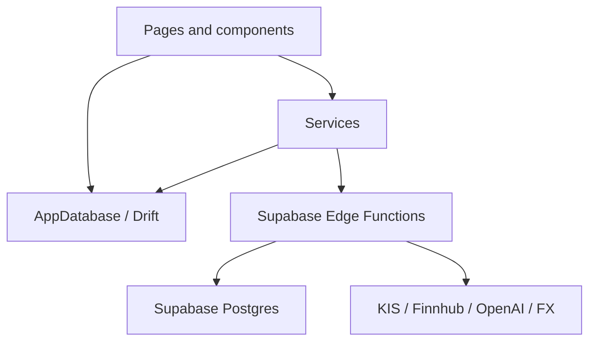
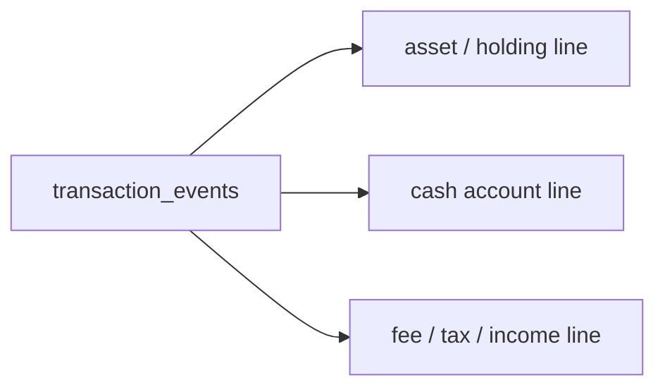
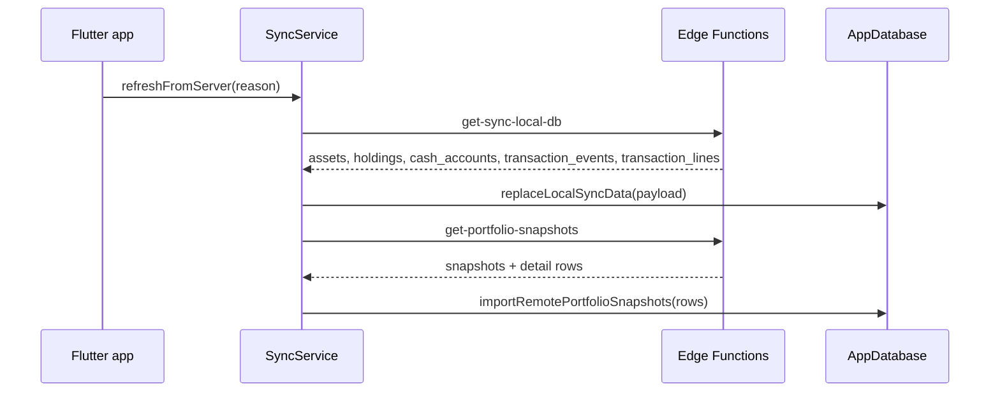
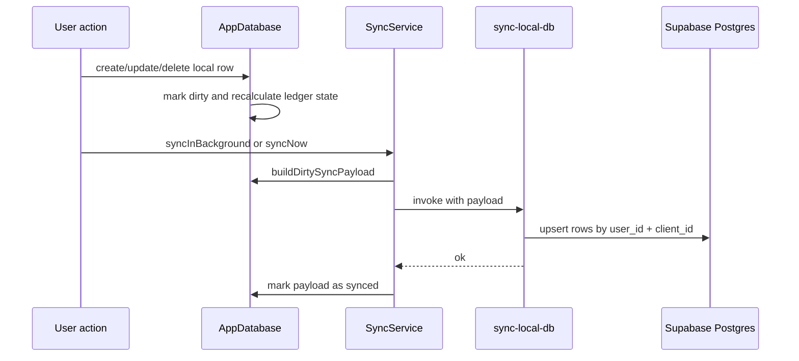

# Data And Sync Flow

MONEYFY는 local-first 앱입니다. 화면은 대부분 로컬 Drift SQLite DB를 읽고, 로그인 상태에서는 Supabase Edge Functions를 통해 원격 DB와 동기화합니다.

## Data Layers

| 계층 | 대표 파일 | 책임 |
| --- | --- | --- |
| UI | `lib/pages/`, `lib/components/` | 사용자의 입력, 조회, 화면 상태 |
| Service | `lib/services/` | 인증, 동기화, 외부 API 호출, 캐시 |
| Local DB | `lib/db/app_database.dart` | 로컬 테이블, 마이그레이션, 원장 계산 |
| Edge Functions | `supabase/functions/` | 원격 동기화, 뉴스/AI/스냅샷 서버 작업 |
| Remote DB | `supabase/migrations/` | Supabase Postgres schema |

## Local Drift Tables

`lib/db/app_database.dart`에 정의된 주요 테이블입니다.

| 테이블 | 의미 |
| --- | --- |
| `Assets` | 자산군 또는 포트폴리오 그룹 |
| `Holdings` | 개별 보유 종목 |
| `CashAccounts` | 현금 계좌 |
| `TransactionEvents` | 정규화된 거래 이벤트 헤더 |
| `TransactionLines` | 거래 이벤트의 회계/원장 라인 |
| `DailyPortfolioSnapshots` | 일별 총자산 스냅샷 |
| `DailyPortfolioSnapshotItems` | 스냅샷 시점의 자산군 항목 |
| `DailyPortfolioSnapshotHoldingItems` | 스냅샷 시점의 보유 종목 항목 |
| `AssetAllocationTargets` | 목표 자산 비중 |
| `ExchangeRates` | 표시 통화 환산용 환율 |
| `MarketNewsCaches` | 시장 뉴스 요약 로컬 캐시 |
| `CompanyNewsCaches` | 보유 종목별 뉴스 요약 로컬 캐시 |

`Transactions`와 `CashTransactions`도 로컬 Drift 코드에 남아 있지만, 현재 Supabase remote schema는 ledger 중심으로 재구성되어 legacy transaction table을 archive/drop한 이력이 있습니다. 신규 흐름은 `TransactionEvents`와 `TransactionLines`를 기준으로 이해하는 편이 좋습니다.

## Ledger Model

거래는 하나의 이벤트와 여러 라인으로 표현됩니다.

예를 들어 매수 거래는 보유 종목 수량과 원가를 늘리는 라인, 결제 현금을 줄이는 라인으로 나뉩니다. 이렇게 분해하면 매수/매도/배당/이자/이체/환전을 같은 방식으로 집계할 수 있습니다.

`AppDatabase`는 원장 라인을 이용해 다음 값을 다시 계산합니다.

- 보유 수량
- 남은 원가
- 실현손익
- 배당/이자 수익
- 현금 계좌 잔액
- 월별/통화별 성과

## Sync Payload

동기화 대상 row에는 대체로 아래 메타데이터가 붙습니다.

| 필드 | 의미 |
| --- | --- |
| `client_id` | 기기 로컬에서 생성한 안정적인 식별자 |
| `dirty` | 원격으로 아직 push되지 않은 변경 |
| `last_modified_at` | 변경 시각 |
| `deleted_at` | soft delete 시각 |

`SyncService.syncNow()`는 `AppDatabase.buildDirtySyncPayload()`로 dirty row를 모아 `sync-local-db` Edge Function에 보냅니다. 서버가 정상 처리하면 `markDirtySyncPayloadAsSynced()`가 dirty 상태를 정리합니다.

## Pull Flow

앱 시작, 로그인 상태 변경, 앱 resume 시 다음 흐름이 실행됩니다.

현재 core payload는 `payload_version == 4`, `schema_mode == ledger_only_delta`를 기대합니다.

## Push Flow

## Snapshot Flow

스냅샷은 특정 날짜의 포트폴리오 상태를 저장합니다.

- 로컬: `saveTodaySnapshotIfMissing()`, `refreshTodaySnapshot()`, `insertManualPortfolioSnapshot()`
- 원격 생성: `create-portfolio-snapshot`
- 원격 조회: `get-portfolio-snapshots`
- 상세 데이터: 자산군, 보유 종목, 현금 계좌, 메모

최근 migration `20260523120000_add_snapshot_client_references.sql`는 스냅샷 상세 row에 `asset_client_id`, `holding_client_id`, `cash_account_client_id`를 추가해 서버 id가 달라도 클라이언트 참조를 복원할 수 있게 합니다.

## Market Data And Caches

`MarketDataService`는 다음 정보를 갱신합니다.

- 국내 주식: KIS quote API
- 해외 주식: KIS overseas quote API
- 펀드/ETF: KIS fund quote API
- 코인: ticker URL template
- USD/KRW: 환율 API

뉴스와 AI 기능은 서버에서 데이터를 가져오고, 앱은 로컬 캐시를 함께 사용합니다.

| 기능 | 앱 서비스 | Edge Function | 로컬 캐시 |
| --- | --- | --- | --- |
| 시장 뉴스 요약 | `MarketNewsSummaryService` | `get-market-news-summary` | `MarketNewsCaches` |
| 종목 뉴스 요약 | `CompanyNewsSummaryService` | `get-user-company-news-summaries` | `CompanyNewsCaches` |
| 포트폴리오 진단 | `PortfolioDiagnosisService` | `get-portfolio-diagnosis` | portfolio diagnosis cache |

## Safe Change Checklist

DB나 동기화 코드를 바꿀 때는 아래를 함께 확인하세요.

- Drift table과 generated code 갱신이 필요한가?
- Supabase migration이 필요한가?
- `buildDirtySyncPayload()`와 `replaceLocalSyncData()`가 새 필드를 처리하는가?
- Edge Function의 payload version 또는 schema mode 변경이 필요한가?
- soft delete와 dirty flag 처리에 누락이 없는가?
- 기존 테스트에 거래/동기화 케이스를 추가해야 하는가?
