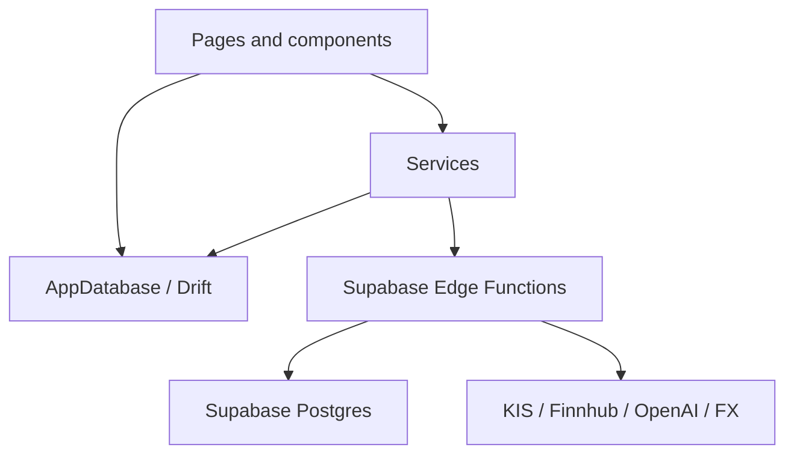
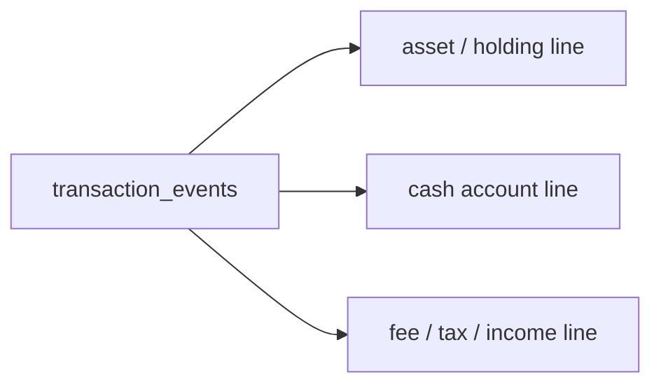
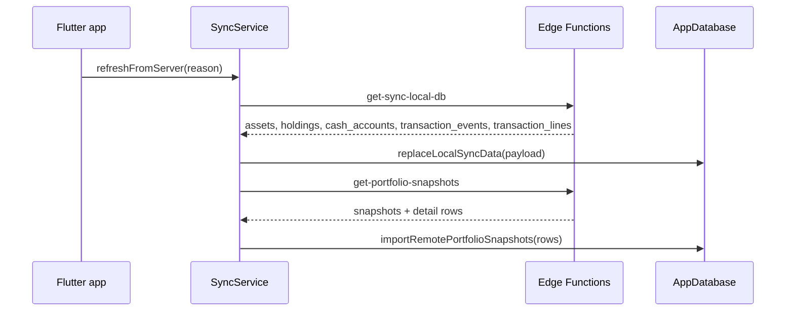
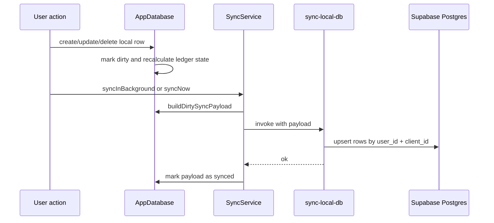

# Data And Sync Flow

MONEYFY는 local-first 앱입니다. 화면은 대부분 로컬 Drift SQLite DB를 읽고, 로그인 상태에서는 Supabase Edge Functions를 통해 원격 DB와 동기화합니다.

## Data Layers



| 계층 | 대표 파일 | 책임 |
| --- | --- | --- |
| UI | `lib/pages/`, `lib/components/` | 사용자의 입력, 조회, 화면 상태 |
| Service | `lib/services/` | 인증, 동기화, 외부 API 호출, 캐시 |
| Local DB | `lib/db/app_database.dart` | 로컬 테이블, 마이그레이션, 원장 계산 |
| Edge Functions | `supabase/functions/` | 원격 동기화, 뉴스/AI/스냅샷 서버 작업 |
| Remote DB | `supabase/migrations/` | Supabase Postgres schema |

## Local Drift Tables

`lib/db/app_database.dart`에 정의된 주요 테이블입니다.

| 테이블 | 의미 |
| --- | --- |
| `Assets` | 자산군 또는 포트폴리오 그룹 |
| `Holdings` | 개별 보유 종목 |
| `CashAccounts` | 현금 계좌 |
| `TransactionEvents` | 정규화된 거래 이벤트 헤더 |
| `TransactionLines` | 거래 이벤트의 회계/원장 라인 |
| `DailyPortfolioSnapshots` | 일별 총자산 스냅샷 |
| `DailyPortfolioSnapshotItems` | 스냅샷 시점의 자산군 항목 |
| `DailyPortfolioSnapshotHoldingItems` | 스냅샷 시점의 보유 종목 항목 |
| `AssetAllocationTargets` | 목표 자산 비중 |
| `ExchangeRates` | 표시 통화 환산용 환율 |
| `MarketNewsCaches` | 시장 뉴스 요약 로컬 캐시 |
| `CompanyNewsCaches` | 보유 종목별 뉴스 요약 로컬 캐시 |

`Transactions`와 `CashTransactions`도 로컬 Drift 코드에 남아 있지만, 현재 Supabase remote schema는 ledger 중심으로 재구성되어 legacy transaction table을 archive/drop한 이력이 있습니다. 신규 흐름은 `TransactionEvents`와 `TransactionLines`를 기준으로 이해하는 편이 좋습니다.

## Ledger Model

거래는 하나의 이벤트와 여러 라인으로 표현됩니다.



예를 들어 매수 거래는 보유 종목 수량과 원가를 늘리는 라인, 결제 현금을 줄이는 라인으로 나뉩니다. 이렇게 분해하면 매수/매도/배당/이자/이체/환전을 같은 방식으로 집계할 수 있습니다.

`AppDatabase`는 원장 라인을 이용해 다음 값을 다시 계산합니다.

- 보유 수량
- 남은 원가
- 실현손익
- 배당/이자 수익
- 현금 계좌 잔액
- 월별/통화별 성과

## Sync Payload

동기화 대상 row에는 대체로 아래 메타데이터가 붙습니다.

| 필드 | 의미 |
| --- | --- |
| `client_id` | 기기 로컬에서 생성한 안정적인 식별자 |
| `dirty` | 원격으로 아직 push되지 않은 변경 |
| `last_modified_at` | 변경 시각 |
| `deleted_at` | soft delete 시각 |

`SyncService.syncNow()`는 `AppDatabase.buildDirtySyncPayload()`로 dirty row를 모아 `sync-local-db` Edge Function에 보냅니다. 서버가 정상 처리하면 `markDirtySyncPayloadAsSynced()`가 dirty 상태를 정리합니다.

## Sync Conflict Policy

여러 기기에서 같은 `client_id` row를 수정하면 `last_modified_at`을 기준으로 충돌을 판정합니다.

| 상황 | 기준 |
| --- | --- |
| 서버 row가 없거나 서버 `last_modified_at`이 없음 | 클라이언트 변경 수락 |
| 클라이언트 `last_modified_at`이 서버보다 최신 | 클라이언트 변경 수락 |
| 클라이언트와 서버 `last_modified_at`이 같음 | 클라이언트 변경 수락 |
| 서버 `last_modified_at`이 클라이언트보다 최신 | 서버 우선, 클라이언트 push 거절 |

정책 이름은 `last_modified_at` 기반 last-writer-wins입니다. 단, tie는 같은 payload 재전송을 안전하게 처리하기 위해 클라이언트 수락으로 봅니다.

`sync-local-db`는 row별로 `accepted_client_ids`와 `conflicts`를 반환합니다. 앱은 `accepted_client_ids`에 포함된 row만 dirty 해제합니다. 서버가 더 최신이라 거절된 row는 dirty 상태가 남고, 이후 pull flow에서 서버 row를 다시 받아 로컬 상태를 맞춥니다.

삭제도 동일한 정책을 따릅니다. `deleted_at`이 있는 soft delete payload라도 `last_modified_at`이 서버보다 오래되면 삭제가 적용되지 않습니다. 거래는 `transaction_events`와 `transaction_lines`가 각각 같은 기준으로 판정되며, 이벤트와 라인은 같은 사용자 조작에서 같은 `last_modified_at`을 갖도록 유지해야 합니다.

## Pull Flow

앱 시작, 로그인 상태 변경, 앱 resume 시 다음 흐름이 실행됩니다.



현재 core payload는 `payload_version == 4`, `schema_mode == ledger_only_delta`를 기대합니다.

## Push Flow



## Snapshot Flow

스냅샷은 특정 날짜의 포트폴리오 상태를 저장합니다.

- 로컬: `saveTodaySnapshotIfMissing()`, `refreshTodaySnapshot()`, `insertManualPortfolioSnapshot()`
- 원격 생성: `create-portfolio-snapshot`
- 원격 조회: `get-portfolio-snapshots`
- 상세 데이터: 자산군, 보유 종목, 현금 계좌, 메모

최근 migration `20260523120000_add_snapshot_client_references.sql`는 스냅샷 상세 row에 `asset_client_id`, `holding_client_id`, `cash_account_client_id`를 추가해 서버 id가 달라도 클라이언트 참조를 복원할 수 있게 합니다.

### Snapshot Calculation Rules

스냅샷과 메인 대시보드는 같은 평가손익 기준을 사용해야 합니다. 스냅샷은 특정 시점의 표시 대상 포트폴리오를 저장하는 값이며, 서버/로컬/프론트 표시 로직은 아래 규칙을 기준으로 맞춥니다.

#### 1. Snapshot Scope

로컬 스냅샷 생성 대상은 사용자의 현재 표시 대상 자산입니다. Supabase 원격 스키마와 Edge Function은 숨김 상태를 저장하거나 필터링하지 않으며, 숨김 적용은 프론트엔드 로컬 DB에서만 수행합니다.

| row | 포함 조건 | 제외 조건 |
| --- | --- | --- |
| 자산 | 로컬 `deleted_at is null`, 로컬 `hidden = false` | 숨김 자산, 삭제 자산 |
| 보유 종목 | 자산이 포함 대상이고 로컬 `hidden = false`, `quantity > 0` | 숨김 종목, 수량 0 종목 |
| 현금 계좌 | 자산이 포함 대상이고 로컬 `hidden = false` | 숨김 현금 계좌 |

자식 row가 있는 자산에서 모든 자식 row가 제외되면 해당 자산의 평가금액과 매입금액은 `0`으로 둡니다. 이 경우 `asset.value`로 fallback하지 않습니다. 자식 row가 전혀 없는 자산만 `asset.value`를 fallback 값으로 사용합니다.

#### 2. Currency Rules

모든 스냅샷 금액은 KRW 기준으로 저장합니다.

| 통화 | 처리 |
| --- | --- |
| `KRW` | 금액 그대로 사용 |
| `USD` 등 외화 | 스냅샷 생성 시점의 `exchange_rate`로 KRW 환산 |

보유 종목의 `average_price`는 KRW 원가로 저장되어 있으므로 매입금액에는 환율을 다시 적용하지 않습니다. 외화 종목의 현재가는 외화 기준이므로 평가금액 계산 때만 스냅샷 환율을 적용합니다.

#### 3. Row-Level Formulas

| 대상 | 평가금액 | 매입금액 | 평가손익 |
| --- | --- | --- | --- |
| 보유 종목 | `quantity x current_price`의 KRW 환산액 | `quantity x average_price` | 평가금액 - 매입금액 |
| 현금 계좌 | 잔액의 원화 환산액 | 잔액의 원화 환산액 | `0` |
| 자식 row 없는 자산 | `asset.value` 파싱값 | `asset.value` 파싱값 | `0` |

보유 종목 규칙은 다음과 같습니다.

```text
holding purchaseAmount = quantity * averagePrice
holding valuationAmount = KRW-converted(quantity * currentPrice)
holding profitAmount = valuationAmount - purchaseAmount
holding profitRate = purchaseAmount == 0 ? 0 : profitAmount / purchaseAmount * 100
```

현금 계좌 규칙은 다음과 같이 고정합니다.

```text
cash valuationAmount = KRW-converted balance
cash purchaseAmount = KRW-converted balance
cash profitAmount = 0
cash profitRate = 0
```

외화 현금의 원화 환산액은 환율에 따라 변할 수 있지만, 그 차이는 투자 평가손익으로 보지 않습니다. 따라서 스냅샷 생성, 스냅샷 상세, 메인 대시보드, 분석 차트는 현금 평가손익을 항상 `0`으로 다루어야 합니다.

#### 4. Asset-Level Formulas

자산군 snapshot item은 포함된 보유 종목과 현금 계좌의 합계입니다.

```text
asset totalPurchaseAmount = sum(holding purchaseAmount) + sum(cash purchaseAmount)
asset totalValuationAmount = sum(holding valuationAmount) + sum(cash valuationAmount)
asset profitAmount = totalValuationAmount - totalPurchaseAmount
asset profitRate = totalPurchaseAmount == 0 ? 0 : profitAmount / totalPurchaseAmount * 100
asset holdingCount = included holding count + included cash account count
```

자산의 alias가 비어 있지 않으면 snapshot 표시명은 alias를 사용하고, 비어 있으면 title을 사용합니다.

#### 5. Snapshot Header Formulas

스냅샷 header는 저장된 자산군 item의 합계로만 계산합니다. header를 직접 별도 로직으로 계산하지 않습니다.

```text
snapshot totalPurchaseAmount = sum(snapshot item totalPurchaseAmount)
snapshot totalValuationAmount = sum(snapshot item totalValuationAmount)
snapshot profitAmount = totalValuationAmount - totalPurchaseAmount
snapshot profitRate = totalPurchaseAmount == 0 ? 0 : profitAmount / totalPurchaseAmount * 100
```

DB 보정이나 import 이후에도 header와 item 합계는 항상 일치해야 합니다.

```text
snapshot.total_purchase_amount == sum(items.total_purchase_amount)
snapshot.total_valuation_amount == sum(items.total_valuation_amount)
snapshot.profit_amount == snapshot.total_valuation_amount - snapshot.total_purchase_amount
```

#### 6. Display Consistency Rules

메인 대시보드, 스냅샷 상세, 분석 차트는 같은 계산 원칙을 사용합니다.

- 총자산은 표시 대상 자산의 평가금액 합계입니다.
- 평가손익은 `총 평가금액 - 총 매입금액`입니다.
- 현금은 총자산에 포함하지만 평가손익에는 영향을 주지 않습니다.
- 숨김 자산/숨김 종목/숨김 현금 계좌는 프론트엔드 로컬 표시 기준 합계에서 제외합니다.
- 기간 비교 수익은 평가손익이 아니라 snapshot 간 총자산 변화입니다.

관련 보정 내역은 [Cash Snapshot Profit Fix Report](features/bug_fixes/cash_snapshot_profit_fix/test_report_20260524.md)에 기록합니다.

### Snapshot Client Reference Rules

스냅샷 상세 row는 서버 DB id와 함께 stable `client_id` 참조를 저장합니다. 멀티 디바이스 sync나 로컬 DB 재생성 뒤에는 같은 자산/보유/현금 계좌라도 local integer id가 달라질 수 있으므로, 앱은 원격 스냅샷을 import할 때 client reference를 우선 사용합니다.

| 상세 row | server id | stable reference |
| --- | --- | --- |
| `daily_portfolio_snapshot_items` | `asset_id` | `asset_client_id` |
| `daily_portfolio_snapshot_holding_items` | `asset_id`, `holding_id` | `asset_client_id`, `holding_client_id` |
| `daily_portfolio_snapshot_cash_accounts` | `asset_id`, `cash_account_id` | `asset_client_id`, `cash_account_client_id` |

처리 순서는 다음과 같습니다.

1. `create-portfolio-snapshot`는 asset, holding, cash account를 조회할 때 `client_id`도 함께 읽고 snapshot detail payload에 저장합니다.
2. `get-portfolio-snapshots`는 위 client reference 필드를 앱에 반환합니다.
3. `AppDatabase.importRemotePortfolioSnapshots()`는 local table의 `client_id -> id` map을 먼저 만들고, 원격 detail row의 client reference가 있으면 local id로 remap합니다.
4. client reference가 비어 있거나 local 매칭이 없으면 기존 server id 필드를 fallback으로 사용합니다.

이 규칙 덕분에 원격 snapshot detail이 오래된 server id를 들고 있거나, 로컬에서 더미 row 생성 뒤 sync restore가 일어나도 표시용 스냅샷/보유 종목 상세가 현재 local row와 다시 연결됩니다.

## Market Data And Caches

`MarketDataService`는 다음 정보를 갱신합니다.

- 국내 주식: KIS quote API
- 해외 주식: KIS overseas quote API
- 펀드/ETF: KIS fund quote API
- 코인: ticker URL template
- USD/KRW: 환율 API

뉴스와 AI 기능은 서버에서 데이터를 가져오고, 앱은 로컬 캐시를 함께 사용합니다.

| 기능 | 앱 서비스 | Edge Function | 로컬 캐시 |
| --- | --- | --- | --- |
| 시장 뉴스 요약 | `MarketNewsSummaryService` | `get-market-news-summary` | `MarketNewsCaches` |
| 종목 뉴스 요약 | `CompanyNewsSummaryService` | `get-user-company-news-summaries` | `CompanyNewsCaches` |
| 포트폴리오 진단 | `PortfolioDiagnosisService` | `get-portfolio-diagnosis` | portfolio diagnosis cache |

## Safe Change Checklist

DB나 동기화 코드를 바꿀 때는 아래를 함께 확인하세요.

- Drift table과 generated code 갱신이 필요한가?
- Supabase migration이 필요한가?
- `buildDirtySyncPayload()`와 `replaceLocalSyncData()`가 새 필드를 처리하는가?
- Edge Function의 payload version 또는 schema mode 변경이 필요한가?
- soft delete와 dirty flag 처리에 누락이 없는가?
- 기존 테스트에 거래/동기화 케이스를 추가해야 하는가?
