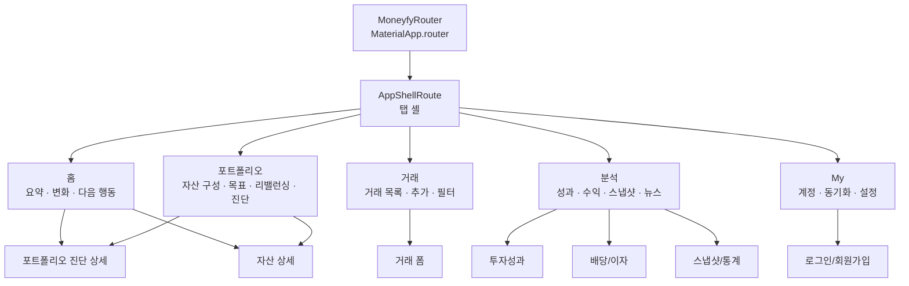

# 00. Overview And Routing

## 배경

현재 MONEYFY는 `AppShellPage`의 `IndexedStack` 기반 6개 하단 탭으로 구성되어 있다.

- 홈: 총자산 요약, 자산 목록, 진단 진입
- 포트폴리오: 비중, 목표 비중, 리밸런싱, 포트폴리오 진단 생성/요약
- 거래: 거래 목록, 필터, 거래 추가
- 분석: 뉴스 요약, 포트폴리오 진단, 투자성과, 배당/이자
- 통계: 월별 총자산, 월말 스냅샷, 연도별 분석, 캘린더
- My: 계정, 동기화, GPT용 데이터 복사 유틸리티

전수조사 결과는 `docs/page_inventory_graph.md`, 초기 리뷰는 `docs/page_flow_review.md`에 정리되어 있다.

## 문제 정의

- 포트폴리오 탭에서 비중/리밸런싱 문제를 발견해도 해당 `AssetDetailPage`로 바로 들어갈 수 없다.
- Plan D 이전에는 `포트폴리오 진단`, `AI 포트폴리오 분석`, `PortfolioAnalysisMvpPage`가 서로 다른 위치와 이름으로 노출되었다.
- `분석`과 `통계`는 모두 리포트성 화면이라 경계가 흐리다.
- 거래 탭의 계좌 없음 상태에서 바로 다음 행동으로 이어지지 못한다.
- `내부 DB 요약 복사 (GPT)`는 자주 쓰는 기능이므로 My 탭 접근성을 유지하되, 명칭과 묶음은 다듬을 여지가 있다.

## 개편 원칙

1. 홈은 “오늘 무엇을 봐야 하는가”에 집중한다.
2. 포트폴리오는 “구성, 목표, 조정”에 집중한다.
3. 거래는 “기록 입력과 검색”에 집중한다.
4. 분석은 “해석과 회고”에 집중한다.
5. My는 “계정, 동기화, 설정, GPT 연계 유틸리티”에 집중한다.
6. 같은 기능은 같은 이름과 같은 목적지를 사용한다.
7. 차트/목록에서 문제를 발견한 곳은 바로 상세로 연결한다.
8. 빈 상태는 설명보다 다음 행동을 우선한다.

## 최종 IA 이미지

최종적으로는 하단 탭을 5개로 줄이고, 앱 전체를 명시적 라우팅 기반으로 전환하는 구조를 권장한다. 다만 이는 최종 목표 이미지이며, 1차 완료 조건은 아니다.

## 라우팅 전환 원칙

- `go_router`/`MaterialApp.router` 전환은 6탭 상태에서 먼저 검증한다.
- 5탭 통합은 라우팅이 안정화된 뒤 별도 계획으로 결정한다.
- 5탭 통합과 라우터 전환을 같은 배포 단위에 넣지 않는다.
- 1차 라우터 전환에서는 `_StartupGate`의 초기화 책임을 유지한다.
- `go_router redirect`와 인증 상태 연동은 별도 후속 후보로 남긴다.
- 시작 오류 화면과 데이터 스코프 리셋은 라우터 전환 중 약화하지 않는다.

## Route 초안

| 영역 | Route name | Path | 대상 |
| --- | --- | --- | --- |
| 시작 | `startup` | `/startup` | `_StartupGate` 또는 초기화 게이트 |
| 홈 | `home` | `/home` | `PortfolioDashboardPage` |
| 포트폴리오 | `portfolio` | `/portfolio` | `PortfolioPage` |
| 거래 | `transactions` | `/transactions` | `TransactionsPage` |
| 분석 | `insights` | `/insights` | `AnalysisPage` 또는 통합 분석 탭 |
| 통계 | `statistics` | `/statistics` | `StatisticsPage` 1차 유지 |
| My | `my` | `/my` | `MyPage` |
| 자산 상세 | `assetDetail` | `/assets/:assetId` | `AssetDetailPage` |
| 보유 종목 상세 | `holdingDetail` | `/holdings/:holdingId` | `HoldingDetailPage` |
| 현금 계좌 상세 | `cashAccountDetail` | `/cash-accounts/:holdingId` | `CashAccountDetailPage` |
| 스냅샷 상세 | `snapshotDetail` | `/snapshots/:snapshotId` | `SnapshotDetailPage` |
| 포트폴리오 진단 | `portfolioDiagnosis` | `/portfolio/diagnosis` | 통합 진단 상세 |
| 투자성과 | `investmentPerformance` | `/insights/performance` | `InvestmentPerformancePage` |
| 배당/이자 | `incomeAnalysis` | `/insights/income` | `DividendInterestAnalysisPage` |
| 로그인 | `login` | `/login` | `LoginPage` |
| 회원가입 | `signup` | `/signup` | `SignupPage` |

## 데이터 전달 원칙

- `assetId`, `holdingId`는 path parameter로 둔다.
- `clientId` fallback은 query parameter 또는 typed extra로 보존한다.
- `SnapshotDetailPage`처럼 현재 객체 전체를 받는 화면은 route 전환 전에 `snapshotId` 기반 재조회 가능 여부를 먼저 확인한다.
- 재조회가 어려운 화면은 1차 라우터 전환 대상에서 제외하고 `extra` 기반 임시 route로만 다룬다.
- 폼 route는 데이터 저장 후 결과 반환이 중요하므로 1차에서는 기존 modal push 패턴을 유지한다.
