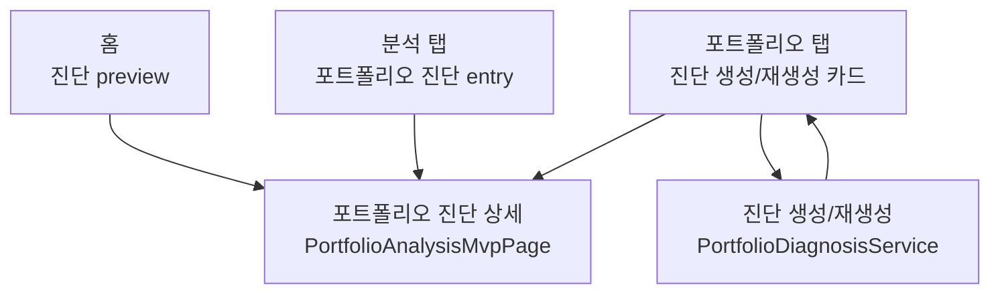

# Plan D. Portfolio Diagnosis Unification

## 역할

포트폴리오 진단의 제품명, 진입점, 화면 역할을 통일한다.

Plan D는 라우팅 전환이나 진단 알고리즘 개선이 아니라, **사용자가 홈/포트폴리오/분석 어디에서 시작해도 같은 진단 기능을 보고 있다고 이해하게 만드는 IA/UX 정리 작업**이다.

## 현재 문제

| 위치 | 현재 표현/동작 | 문제 |
| --- | --- | --- |
| 홈 `InsightCard` | 캐시된 진단 요약 또는 집중도 힌트, 탭하면 포트폴리오 탭의 진단 카드로 이동 | 홈에서 누른 결과가 상세 페이지가 아니라 다른 탭의 하단 카드로 이동해 기대가 어긋날 수 있음 |
| 포트폴리오 탭 `PortfolioDiagnosisSectionCard` | `AI 포트폴리오 분석`, 생성/재생성/상세 결과를 같은 카드에서 처리 | 앱 내 대표 명칭인 `포트폴리오 진단`과 다르게 보임 |
| 분석 탭 entry card | `포트폴리오 진단`, `PortfolioAnalysisMvpPage`로 이동 | 같은 기능처럼 보이지만 생성형 AI 진단 카드와 다른 로컬 분석 상세로 보임 |
| `PortfolioAnalysisMvpPage` | title `포트폴리오 진단`, 로컬 계산 기반 위험/조정 후보/집중도 상세 | 생성형 AI 결과를 보여주는 페이지가 아니라 로컬 진단 상세라 역할이 불명확함 |
| route registry | `portfolioDiagnosis` -> `/analysis/portfolio-diagnosis` -> `PortfolioAnalysisMvpPage` | Plan C 기준선은 있으나 제품상 의미 확정이 필요 |

## 결정

### 대표 제품명

- 사용자에게 보이는 대표 이름은 `포트폴리오 진단`으로 통일한다.
- `AI 포트폴리오 분석`은 기능명으로 쓰지 않는다.
- AI/규칙 기반/로컬 계산 여부는 본문 또는 출처 캡션에서만 설명한다.

### 화면 역할

| 화면/영역 | Plan D 이후 역할 |
| --- | --- |
| 홈 인사이트 카드 | 최신 진단 요약 preview와 빠른 진입점 |
| 포트폴리오 탭 진단 카드 | 진단 생성/재생성 컨트롤과 최신 AI/규칙 기반 결과 summary |
| 분석 탭 `포트폴리오 진단` entry | 전체 진단 상세로 들어가는 대표 entry |
| `PortfolioAnalysisMvpPage` | 포트폴리오 진단 상세 화면. 로컬 계산 기반의 위험 신호/조정 후보/집중도/성과 기여 상세를 담당 |

### 진입 정책

- Plan D 구현에서는 홈 진입을 더 이상 포트폴리오 탭 하단 focus로 보내지 않는 방향을 우선 검토한다.
- 홈과 분석 탭은 `MoneyfyNavigation.openPortfolioDiagnosis()`로 같은 상세 화면에 들어간다.
- 포트폴리오 탭은 생성/재생성 카드 역할을 유지하되, 생성된 결과가 있을 때 상세 진단으로 이동하는 CTA를 제공한다.
- 진단 생성 자체는 계속 포트폴리오 탭에서 수행한다.

## 범위

- 사용자 표시 명칭을 `포트폴리오 진단` 중심으로 정리.
- 홈/포트폴리오/분석의 진단 진입 역할을 분리.
- `PortfolioAnalysisMvpPage`의 제품상 역할과 화면 문구 정리.
- Plan C의 `portfolioDiagnosis` helper를 대표 상세 진입점으로 사용.
- 진단 데이터 없음/생성 중/생성 완료 상태의 UX 문구 정리.
- 진단 진입 그래프와 route matrix 보강.

## 제외

- 진단 알고리즘 변경.
- `PortfolioDiagnosisService` API 호출 구조 변경.
- Supabase edge function 변경.
- `go_router` 또는 `MaterialApp.router` 전환.
- 분석/통계 탭 통합.
- 5탭 통합.
- form route 변경.
- snapshot/annual analysis route 변경.
- GPT용 DB 요약 복사 기능 위치 변경.

## 산출물

- 코드 변경.
- 진단 진입 그래프 업데이트.
- `docs/features/new_feature_development/page_flow_redesign/implementation_report_plan_d.md`
- `docs/features/new_feature_development/page_flow_redesign/test_report_plan_d.md`

## 대상 파일

| 파일 | 역할 |
| --- | --- |
| `lib/pages/app_shell_page.dart` | 홈 진단 진입 정책 변경 후보 |
| `lib/pages/portfolio_dashboard_page.dart` | 홈 인사이트 preview 문구/진입점 정리 |
| `lib/pages/portfolio_page.dart` | 생성/재생성 카드 명칭과 상세 CTA 정리 |
| `lib/pages/analysis_page.dart` | 분석 탭 entry 문구 유지/미세 조정 |
| `lib/pages/portfolio_analysis_mvp_page.dart` | 상세 화면 title/subtitle/empty 문구 정리 |
| `lib/navigation/moneyfy_navigation.dart` | 기존 `openPortfolioDiagnosis` helper 사용 확인 |
| `docs/page_inventory_graph.md` | 진단 진입 그래프 갱신 후보 |
| `docs/features/new_feature_development/page_flow_redesign/route_matrix.md` | Plan D 결과 반영 |

## 진입 그래프 목표

## 세부 작업

### D1. 명칭 사전 확정

목표:

- 앱 안에서 같은 기능에 다른 이름을 쓰지 않게 한다.

구현:

- 사용자 노출 대표명: `포트폴리오 진단`.
- 버튼 문구 후보:
  - 데이터 없음: `포트폴리오 진단 생성`
  - 생성 중: 기존 loading 상태 유지
  - 생성 완료: `진단 새로 생성`
  - 상세 이동: `상세 진단 보기`
- 출처 캡션 후보:
  - AI 결과: `진단 출처: AI 모델`
  - fallback: `진단 출처: 규칙 기반`
- `AI 포트폴리오 분석` 문구는 사용자 노출 title/primary button에서 제거한다.

완료 조건:

- `rg "AI 포트폴리오 분석" lib/pages` 결과가 사용자 노출 주요 문구에 남지 않는다.
- 진단 기능의 대표 title은 `포트폴리오 진단`으로 통일된다.

### D2. 홈 인사이트 진입점 정리

목표:

- 홈 preview를 눌렀을 때 사용자가 상세 진단으로 간다고 예측할 수 있게 한다.

구현 후보:

- `PortfolioDashboardPage`의 `onOpenPortfolioDiagnosis`를 `context.openPortfolioDiagnosis` 기반으로 바꾼다.
- `AppShellPage._openPortfolioDiagnosisFromHome()`의 포트폴리오 탭 focus 방식은 제거하거나 사용하지 않게 한다.
- 홈 카드가 캐시된 진단이 있을 때는 summary preview + 상세 진입.
- 캐시된 진단이 없고 자산 집중도 힌트만 있을 때도 상세 진단으로 보낼지, 포트폴리오 탭 생성 카드로 보낼지 결정한다.

권장안:

- 캐시 진단이 있으면 상세 진단으로 이동.
- 캐시 진단이 없으면 포트폴리오 탭의 생성 카드로 이동하거나, 카드에 `포트폴리오 탭에서 진단을 생성하세요` 성격의 CTA를 둔다.
- 단, Plan D 완료 조건인 “어느 진입점에서 눌러도 같은 진단 경험”을 우선하려면 홈도 상세 화면으로 보내고, 상세 화면 empty state에서 생성 위치를 안내한다.

완료 조건:

- 홈 진입이 포트폴리오 탭 하단 focus인지 상세 화면인지 코드와 문서에 명확히 확정된다.
- 홈 진입 결과가 분석 탭 entry와 충돌하지 않는다.

### D3. 포트폴리오 탭 생성 카드 역할 정리

목표:

- 포트폴리오 탭의 진단 카드는 “상세 페이지”가 아니라 “생성/재생성 및 최신 결과 summary”라는 역할을 갖는다.

구현:

- section title을 `포트폴리오 진단`으로 변경.
- empty state title/body/button에서 `AI 포트폴리오 분석`을 제거.
- 생성 완료 상태에서 summary, score, strengths/weaknesses/suggestions는 유지한다.
- 생성 완료 상태에 `상세 진단 보기` CTA를 추가하는 방안을 검토한다.
- CTA는 `context.openPortfolioDiagnosis()`를 사용한다.

주의:

- `PortfolioDiagnosisService.fetchDiagnosis` 호출 방식은 바꾸지 않는다.
- `diagnosisPayload` 생성 로직은 바꾸지 않는다.

완료 조건:

- 포트폴리오 탭에서 생성/재생성 흐름은 유지된다.
- 생성 완료 상태에서 상세 진단으로 이동할 수 있다.
- 상세 이동과 재생성 버튼의 역할이 분리된다.

### D4. 분석 탭 entry와 상세 화면 역할 정리

목표:

- `PortfolioAnalysisMvpPage`가 “포트폴리오 진단 상세”임을 명확히 한다.

구현:

- `AnalysisPage` entry title은 `포트폴리오 진단` 유지.
- entry subtitle은 `위험 신호 · 조정 후보 · 집중도 점검` 유지 또는 상세 성격을 더 명확히 조정.
- `PortfolioAnalysisMvpPage` title은 `포트폴리오 진단` 유지.
- subtitle 후보: `위험 신호, 조정 후보, 집중도를 한곳에서 확인해요`.
- empty state 문구의 `MVP 분석 구성` 같은 내부 표현은 제거한다.

주의:

- `PortfolioAnalysisMvpPage` class name 변경은 Plan D에서 필수는 아니다.
- 파일명/class명 변경은 import churn이 크므로 문구 정리 후 별도 후속 후보로 남길 수 있다.

완료 조건:

- 상세 화면에 내부 개발 용어 `MVP`가 사용자 노출 문구로 남지 않는다.
- 분석 탭 entry와 상세 화면 title이 같은 개념으로 보인다.

### D5. 상태별 UX 확인

목표:

- 진단 데이터 없음/생성 중/생성 완료 상태를 각각 확인 가능하게 한다.

상태 정의:

| 상태 | 판단 | 기대 UI |
| --- | --- | --- |
| 자산 없음 | 진단/상세 계산 대상 없음 | 자산 추가 안내 |
| 진단 캐시 없음 | `PortfolioDiagnosisResult == null` | 포트폴리오 탭에서 진단 생성 CTA |
| 생성 중 | `_isGeneratingDiagnosis == true` | 생성 버튼 loading |
| 생성 완료 | `PortfolioDiagnosisResult != null` | summary, score, 출처, 생성일, 재생성, 상세 보기 |
| fallback 결과 | `analysisSource == fallback_rule_based` | 규칙 기반 출처 캡션 |

완료 조건:

- 각 상태가 코드상 어디에서 처리되는지 구현 리포트에 기록된다.
- 최소한 위젯 테스트 또는 수동 QA 결과가 `test_report_plan_d.md`에 기록된다.

### D6. 테스트 보강

목표:

- 명칭 통일과 진입점 통일이 다시 깨지지 않게 한다.

자동 테스트 후보:

- `flutter analyze`
- `flutter test test/page_walkthrough_test.dart`
- 가능하면 targeted widget test 추가:
  - 분석 탭 entry `포트폴리오 진단`이 `PortfolioAnalysisMvpPage`를 연다.
  - 포트폴리오 탭 진단 카드 title이 `포트폴리오 진단`이다.
  - 사용자 노출 문구에 `AI 포트폴리오 분석`이 남지 않는다.
  - `PortfolioAnalysisMvpPage` empty state에 `MVP`가 노출되지 않는다.

주의:

- Plan B/C에서 `page_walkthrough_test.dart`의 `bottom-tab-홈` 실패가 이미 기록되어 있다.
- 같은 실패가 재현되면 Plan D 회귀인지 기존 앱 셸 테스트 이슈인지 분리해서 기록한다.

완료 조건:

- `flutter analyze` 결과가 기록된다.
- 관련 테스트 결과 또는 실패 원인이 문서에 기록된다.

### D7. 문서 갱신

목표:

- Plan D 이후 진단 기능의 진입/역할이 문서와 코드에서 일치하게 한다.

구현:

- `route_matrix.md`의 `PortfolioAnalysisMvpPage` 메모를 Plan D 결과로 갱신한다.
- `docs/page_inventory_graph.md`의 진단 진입 흐름을 갱신한다.
- `implementation_report_plan_d.md` 작성.
- `test_report_plan_d.md` 작성.

완료 조건:

- 진단 진입 그래프가 홈/포트폴리오/분석의 역할 분리를 보여준다.
- 구현 리포트에 범위 밖 미착수 항목이 명시된다.

## 건드리지 말 것

- 진단 점수 계산 또는 AI prompt/API 응답 schema.
- `PortfolioDiagnosisService`의 fetch/cache 정책.
- Supabase edge function.
- route registry path/name 변경. 단, 문서 메모는 갱신 가능.
- `go_router`, `MaterialApp.router`.
- 분석/통계 탭 통합.
- 5탭 통합.
- form route.
- GPT용 DB 요약 복사 기능의 위치/노출.

## 회귀 위험

| 위험 | 영향 | 대응 |
| --- | --- | --- |
| 홈 진입을 상세로 바꾸며 진단 생성 위치를 잃음 | 캐시 없는 사용자가 막힘 | 상세 empty state 또는 홈 preview에서 생성 위치 안내 |
| 포트폴리오 탭 카드에 버튼이 늘어나 역할이 흐려짐 | 생성/상세 이동 혼동 | primary는 생성/재생성, secondary는 상세 보기로 분리 |
| `PortfolioAnalysisMvpPage`가 AI 결과를 보여준다고 오해 | 사용자 기대 불일치 | subtitle과 섹션명을 로컬 상세 진단 성격으로 명확히 작성 |
| class/file rename을 같이 진행 | 불필요한 import churn | Plan D에서는 class/file rename을 보류 |
| 기존 `portfolioDiagnosis` route 의미 변경 | Plan C 기준 흔들림 | route name/path는 유지하고 제품 문구만 정리 |

## 완료 체크리스트

- [x] 사용자 노출 대표명이 `포트폴리오 진단`으로 통일된다.
- [x] `AI 포트폴리오 분석`이 주요 title/button 문구에서 제거된다.
- [x] 홈 진단 preview의 이동 정책이 코드와 문서에 확정된다.
- [x] 포트폴리오 탭 진단 카드는 생성/재생성 역할을 유지한다.
- [x] 생성 완료 상태에서 상세 진단으로 들어갈 수 있다.
- [x] 분석 탭 entry와 상세 화면 title/subtitle이 같은 개념으로 정리된다.
- [x] `PortfolioAnalysisMvpPage`의 사용자 노출 문구에서 내부 용어 `MVP`가 제거된다.
- [x] 진단 데이터 없음/생성 중/생성 완료/fallback 상태의 처리 위치가 기록된다.
- [x] 진단 알고리즘, 서비스 fetch/cache 정책, edge function을 바꾸지 않았다.
- [x] `go_router`, 5탭 통합, form route를 건드리지 않았다.
- [x] 진단 진입 그래프와 route matrix가 갱신된다.
- [x] `flutter analyze` 결과가 기록된다.
- [x] 관련 테스트 또는 테스트 실패 원인이 `test_report_plan_d.md`에 기록된다.

## 완료 조건

- 사용자는 홈/포트폴리오/분석 어디에서 시작해도 `포트폴리오 진단`이라는 같은 기능을 보고 있다고 이해할 수 있다.
- 생성/재생성과 상세 진단 보기의 역할이 분리된다.
- 진단 데이터 없음/생성 중/생성 완료 상태가 모두 확인 가능하다.
- Plan D 범위 밖 알고리즘/라우터/탭 통합 작업을 시작하지 않았다.
- 검증 결과와 미해결 테스트 이슈가 문서에 기록된다.
- 완료 후 다음 계획을 자동으로 시작하지 않는다.
