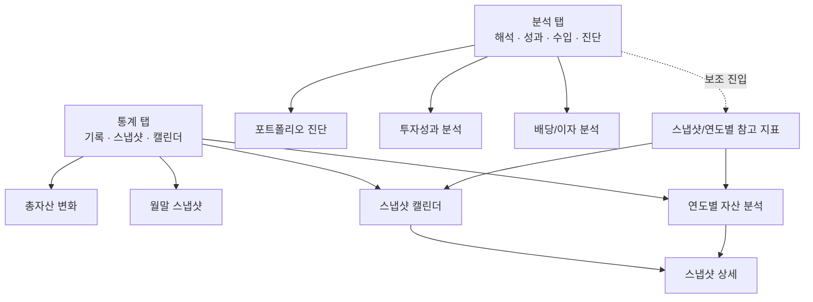

# Plan E. Analysis / Statistics IA Cleanup

## 역할

분석 탭과 통계 탭의 책임을 명확히 한다.

Plan E는 탭을 합치거나 route 구조를 바꾸는 작업이 아니라, **분석은 해석/성과/수입/진단, 통계는 기록/스냅샷/캘린더/월말 추적**이라는 역할을 사용자가 UI 문구와 카드 구조만 보고 이해하게 만드는 정리 작업이다.

## 현재 문제

| 위치 | 현재 역할 | 문제 |
| --- | --- | --- |
| `AnalysisPage` 상단 | 뉴스 요약, 회사 뉴스, 포트폴리오 진단, 투자성과, 배당/이자 | 해석/성과 성격은 명확하지만 아래쪽에 스냅샷 캘린더와 연도별 자산분석도 있어 통계 탭과 겹침 |
| `AnalysisPage` 스냅샷/연도별 섹션 | `SnapshotDetailPage`, `AnnualAssetAnalysisPage` 진입 | 통계 탭에도 같은 성격의 진입이 있어 소속 기준이 흐림 |
| `StatisticsPage` | 총자산 변화, 월말 스냅샷, 연도별 자산 분석, 스냅샷 캘린더 | 기록/스냅샷 성격은 있지만 title만 `통계`라 분석 탭과의 역할 차이가 약함 |
| `AnnualAssetAnalysisPage` | 연도별 자산분석 | 분석/통계 양쪽에서 진입 가능하지만 목적 설명이 분리되어 있지 않음 |
| `SnapshotDetailPage` | 특정 날짜 스냅샷 상세 | 분석/통계 양쪽 진입 가능. route 전환 전까지 객체 전달 구조 유지 필요 |

## 결정

### 탭 역할

| 탭 | 역할 | 주요 콘텐츠 |
| --- | --- | --- |
| 분석 | 현재 데이터를 해석하고 의사결정 후보를 보여준다 | 뉴스, 포트폴리오 진단, 투자성과, 배당/이자 |
| 통계 | 기록된 시계열 데이터를 조회하고 검증한다 | 총자산 변화, 월말 스냅샷, 연도별 자산 분석, 스냅샷 캘린더 |

### 스냅샷/연도별 분석 소속

- primary 소속은 `통계` 탭이다.
- `AnalysisPage`에서 기존 스냅샷/연도별 진입을 바로 제거하지 않는다.
- Plan E 구현에서는 분석 탭의 스냅샷/연도별 섹션을 “기록 기반 참고 지표” 또는 “통계로 이어지는 보조 진입”으로 명확히 표현한다.
- 실제 제거/통합 여부는 Plan H 또는 별도 IA 결정에서 다룬다.

## 범위

- `AnalysisPage` 카드 순서와 섹션 문구 정리.
- `StatisticsPage` 제목/설명/섹션 문구 정리.
- 스냅샷/연도별 분석 진입점의 primary 소속을 문서와 UI에서 명확화.
- 기존 `SnapshotDetailPage`, `AnnualAssetAnalysisPage`, `InvestmentPerformancePage`, `DividendInterestAnalysisPage` 진입 유지.
- `route_matrix.md`, `docs/page_inventory_graph.md`, `test_coverage_matrix.md` 보강.

## 제외

- 5탭 통합.
- `StatisticsPage` 제거.
- `AnalysisPage`에서 스냅샷/연도별 진입 삭제.
- `MaterialApp.router` 또는 `go_router` 전환.
- `SnapshotDetailPage` route loader 리팩터.
- `AnnualAssetAnalysisPage` route loader 리팩터.
- 투자성과/배당/이자 계산 로직 변경.
- 뉴스 summary fetch/cache 정책 변경.

## 산출물

- 코드 변경.
- `docs/features/new_feature_development/page_flow_redesign/implementation_report_plan_e.md`
- `docs/features/new_feature_development/page_flow_redesign/test_report_plan_e.md`

## 대상 파일

| 파일 | 역할 |
| --- | --- |
| `lib/pages/analysis_page.dart` | 분석 탭 카드 순서/문구/스냅샷 보조 진입 설명 정리 |
| `lib/pages/statistics_page.dart` | 통계 탭 제목/섹션 설명/스냅샷 중심 문구 정리 |
| `lib/pages/annual_asset_analysis_page.dart` | title/empty 문구 미세 조정 후보 |
| `docs/page_inventory_graph.md` | 분석/통계 진입 그래프 갱신 |
| `docs/features/new_feature_development/page_flow_redesign/route_matrix.md` | Plan E 소속 기준 기록 |
| `docs/features/new_feature_development/page_flow_redesign/test_coverage_matrix.md` | Plan E 검증 기준 갱신 |

## 목표 IA

## 세부 작업

### E1. 분석 탭 역할 문구 정리

목표:

- 분석 탭이 “현재 포트폴리오를 해석하고 의사결정 후보를 보여주는 곳”으로 보이게 한다.

구현 후보:

- `AnalysisPage` title은 `분석` 유지.
- 상단 카드 순서는 아래처럼 유지하거나 미세 조정한다.
  - 뉴스 요약
  - 회사 뉴스
  - 포트폴리오 진단
  - 투자성과 분석
  - 배당/이자 분석
- entry subtitle 후보:
  - 포트폴리오 진단: `위험 신호 · 조정 후보 · 집중도 점검`
  - 투자성과 분석: `실현손익 · 순투자성과 · 성과 기여`
  - 배당/이자 분석: `월별 수입 · 연 총합 · 종목별 수입`
- 분석 탭 하단의 스냅샷/연도별 섹션이 있다면 `기록 기반 참고 지표` 성격을 드러낸다.

완료 조건:

- 분석 탭의 주요 entry 문구가 해석/성과/수입 중심으로 정리된다.
- 스냅샷/연도별 진입은 남아 있더라도 primary 기록 화면처럼 보이지 않는다.

### E2. 통계 탭 역할 문구 정리

목표:

- 통계 탭이 “기록된 스냅샷을 조회하고 비교하는 곳”으로 보이게 한다.

구현 후보:

- `StatisticsPage` title은 `통계` 유지.
- 가능하면 subtitle 또는 첫 섹션 문구에서 `스냅샷과 기록 기준`을 드러낸다.
- 섹션 문구 후보:
  - 월말 스냅샷: `월말 기준 총자산 기록을 비교해요`
  - 연도별 자산 분석: `스냅샷 기록을 연도 단위로 비교해요`
  - 스냅샷 캘린더: `날짜별 저장 기록과 거래 흔적을 확인해요`
- empty state 문구는 `스냅샷이 쌓이면...` 흐름 유지.

완료 조건:

- 통계 탭의 제목/설명만 보고 기록/스냅샷 중심 화면임을 알 수 있다.
- 기존 월말/연도별/캘린더 진입이 유지된다.

### E3. 스냅샷/연도별 진입 소속 기준 명시

목표:

- 같은 상세 화면이 분석/통계 양쪽에서 열리더라도 primary 소속을 혼동하지 않게 한다.

구현:

- 문서 기준:
  - `SnapshotDetailPage`: 통계 탭 primary, 분석 탭 보조 진입.
  - `AnnualAssetAnalysisPage`: 통계 탭 primary, 분석 탭 보조 진입.
- UI 기준:
  - 분석 탭에서는 “기록 기반 참고” 또는 “스냅샷 기반 참고” 표현 사용.
  - 통계 탭에서는 “월말 스냅샷”, “스냅샷 캘린더”, “연도별 자산 분석” 표현 유지.

완료 조건:

- `route_matrix.md`에 primary/secondary 소속이 기록된다.
- `docs/page_inventory_graph.md`에 분석의 보조 진입과 통계의 primary 진입이 구분된다.

### E4. 기존 진입 보존

목표:

- Plan E가 IA 문구 정리 단계인 만큼 기존 기능 진입을 없애지 않는다.

보존 대상:

- `AnalysisPage` -> `PortfolioAnalysisMvpPage`
- `AnalysisPage` -> `InvestmentPerformancePage`
- `AnalysisPage` -> `DividendInterestAnalysisPage`
- `AnalysisPage` -> `SnapshotDetailPage`
- `AnalysisPage` -> `AnnualAssetAnalysisPage`
- `StatisticsPage` -> `SnapshotDetailPage`
- `StatisticsPage` -> `AnnualAssetAnalysisPage`

완료 조건:

- 위 진입점이 구현 후에도 남아 있다.
- `SnapshotDetailPage`, `AnnualAssetAnalysisPage` 생성자 구조는 변경하지 않는다.

### E5. 테스트/검증

목표:

- 문구 정리로 기존 진입이 깨지지 않았는지 확인한다.

필수:

- `dart format lib/pages/analysis_page.dart lib/pages/statistics_page.dart lib/pages/annual_asset_analysis_page.dart`
- `flutter analyze`

권장:

- `flutter test test/page_walkthrough_test.dart`
- 가능하면 targeted widget test 추가:
  - 분석 탭의 포트폴리오 진단/투자성과/배당 entry가 유지되는지 확인.
  - 통계 탭의 월말 스냅샷/연도별 자산 분석/스냅샷 캘린더 문구가 보이는지 확인.

주의:

- Plan B/C/D에서 `page_walkthrough_test.dart`의 `bottom-tab-홈` 실패가 이미 기록되어 있다.
- 같은 실패가 재현되면 Plan E 회귀인지 기존 앱 셸 테스트 이슈인지 구분해 기록한다.

완료 조건:

- `flutter analyze` 결과가 기록된다.
- 관련 테스트 결과 또는 실패 원인이 `test_report_plan_e.md`에 기록된다.

### E6. 문서 갱신

목표:

- 분석/통계 역할 분리가 코드와 문서에서 일치하게 한다.

구현:

- `route_matrix.md`의 `SnapshotDetailPage`, `AnnualAssetAnalysisPage` 메모에 primary/secondary 소속 기록.
- `docs/page_inventory_graph.md`의 분석/통계 그래프 갱신.
- `test_coverage_matrix.md`의 Plan E 검증 기준 갱신.
- `implementation_report_plan_e.md` 작성.
- `test_report_plan_e.md` 작성.

완료 조건:

- 문서상 분석/통계의 책임이 분리되어 있다.
- 구현 리포트에 유지한 진입점과 건드리지 않은 범위가 명시된다.

## 건드리지 말 것

- 5탭 통합.
- `StatisticsPage` 삭제.
- `AnalysisPage`의 스냅샷/연도별 진입 삭제.
- `SnapshotDetailPage` 생성자 또는 데이터 로딩 방식.
- `AnnualAssetAnalysisPage` 생성자 또는 데이터 로딩 방식.
- 투자성과/배당/이자 계산 로직.
- 뉴스 fetch/cache 정책.
- `go_router`, `MaterialApp.router`.
- form route.

## 회귀 위험

| 위험 | 영향 | 대응 |
| --- | --- | --- |
| 분석 탭에서 스냅샷 진입을 성급히 제거 | 기존 사용자 경로 상실 | Plan E에서는 삭제 금지, 보조 진입으로 표현 |
| 통계 탭이 너무 데이터 저장소처럼만 보임 | 성과 해석 가치 저하 | 월말/연도별 비교 문구는 유지하되 기록 기반임을 명확히 표현 |
| `AnnualAssetAnalysisPage`를 route화하려 함 | 객체 리스트 전달 구조 회귀 | 생성자/route 구조 변경 금지 |
| 테스트 실패를 Plan E 회귀로 오판 | 기존 앱 셸 테스트 이슈와 혼동 | B/C/D의 동일 실패 여부와 비교 기록 |

## 완료 체크리스트

- [x] 분석 탭의 주요 entry 문구가 해석/성과/수입 중심으로 정리된다.
- [x] 통계 탭의 문구가 기록/스냅샷/캘린더 중심으로 정리된다.
- [x] `SnapshotDetailPage` primary 소속은 통계, 분석은 보조 진입으로 기록된다.
- [x] `AnnualAssetAnalysisPage` primary 소속은 통계, 분석은 보조 진입으로 기록된다.
- [x] 기존 분석 하위 페이지 진입이 유지된다.
- [x] 기존 통계 스냅샷/연도별 진입이 유지된다.
- [x] `SnapshotDetailPage`, `AnnualAssetAnalysisPage` 생성자 구조를 바꾸지 않는다.
- [x] 5탭 통합, `StatisticsPage` 제거, router 전환을 하지 않는다.
- [x] `route_matrix.md`, `docs/page_inventory_graph.md`, `test_coverage_matrix.md`가 갱신된다.
- [x] `flutter analyze` 결과가 기록된다.
- [x] 관련 테스트 또는 테스트 실패 원인이 `test_report_plan_e.md`에 기록된다.

## 완료 조건

- UI 문구만 보고 분석은 해석/성과/수입/진단, 통계는 기록/스냅샷/캘린더라는 역할이 구분된다.
- 기존 스냅샷 상세, 연도별 분석, 투자성과, 배당/이자 진입이 유지된다.
- Plan E 범위 밖 탭 통합/라우터/loader 리팩터를 시작하지 않았다.
- 검증 결과와 미해결 테스트 이슈가 문서에 기록된다.
- 완료 후 다음 계획을 자동으로 시작하지 않는다.
