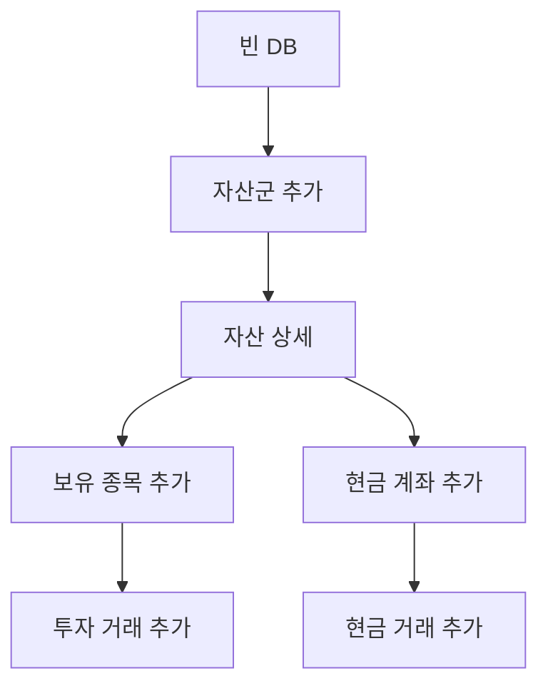

# Plan F. Input Onboarding Cleanup

## 역할

새 사용자가 첫 자산, 첫 보유 종목 또는 현금 계좌, 첫 거래 입력 순서를 자연스럽게 따라가게 만든다.

Plan F는 폼 route 전환이나 데이터 모델 변경이 아니라, **현재 `Navigator.push`와 `push<bool>` 갱신 구조 안에서 빈 상태와 첫 입력 CTA를 정돈하는 작업**이다.

## 현재 문제

| 위치 | 현재 상태 | 문제 |
| --- | --- | --- |
| 홈 empty state | `자산 추가` CTA 제공 | 첫 자산 추가 후 다음 단계인 보유 종목/현금 계좌 생성 안내가 약함 |
| 포트폴리오 empty state | `자산 추가` CTA 제공 | 자산군을 만든 뒤 실제 거래 가능 상태까지의 연결이 약함 |
| 거래 empty state | 계좌 없음이면 `자산 추가`, 계좌 있으면 `거래 추가` | 자산만 있고 보유/현금 계좌가 없으면 거래 가능 상태가 아니라 사용자가 다시 막힐 수 있음 |
| 자산 상세 | 보유 종목/현금 계좌 empty 메시지가 단순 텍스트 | “다음 행동”이 header add icon에만 숨어 있음 |
| 거래 유형 선택 시트 | `세부 계좌와 보유 종목은 다음 화면에서 선택할 수 있어요.` | 투자 거래와 현금 거래의 전제 조건이 충분히 드러나지 않음 |
| 폼 저장 후 갱신 | `push<bool>` 기반으로 상위 reload | Plan I 전까지 이 구조를 건드리면 회귀 위험 큼 |

## 결정

### 첫 입력 권장 순서

### Plan F 원칙

- 첫 자산 추가 후 바로 거래 폼으로 보내지 않는다.
- 거래를 만들려면 먼저 보유 종목 또는 현금 계좌가 필요하다는 점을 empty state와 sheet에서 명확히 한다.
- `AssetFormPage`, `HoldingFormPage`, `CashAccountFormPage`, `TransactionFormPage`, `CashTransactionFormPage`의 edit/save 구조는 바꾸지 않는다.
- `push<bool>` 반환과 상위 reload 책임은 그대로 둔다.
- 새 route helper나 named route 전환은 하지 않는다.

## 범위

- 홈/포트폴리오/거래 empty state 문구와 CTA 정리.
- 자산 상세의 보유 종목/현금 계좌 empty state에 명확한 CTA 제공.
- 거래 유형 선택 시트 설명과 disabled 상태 문구 정리.
- 첫 입력 순서 문서화.
- 폼 저장 후 상위 화면 갱신 규칙 검증.
- 관련 테스트/검증 리포트 작성.

## 제외

- 폼 route 전환.
- named route form helper 추가.
- `go_router` 또는 `MaterialApp.router` 전환.
- 자산/보유/거래 데이터 모델 변경.
- transaction ledger 계산 로직 변경.
- form edit loader 리팩터.
- 계좌/보유 생성 wizard 신설.
- 자동으로 다음 폼을 연달아 띄우는 강제 플로우.

## 산출물

- 코드 변경.
- `docs/features/new_feature_development/page_flow_redesign/implementation_report_plan_f.md`
- `docs/features/new_feature_development/page_flow_redesign/test_report_plan_f.md`

## 대상 파일

| 파일 | 역할 |
| --- | --- |
| `lib/pages/portfolio_dashboard_page.dart` | 홈 empty state 문구와 첫 자산 이후 안내 후보 |
| `lib/pages/portfolio_page.dart` | 포트폴리오 empty state 문구 정리 |
| `lib/pages/transactions_page.dart` | 거래 empty state, 거래 유형 sheet 설명 정리 |
| `lib/pages/asset_detail_page.dart` | 보유 종목/현금 계좌 empty state CTA 정리 |
| `lib/pages/forms/transaction_form_page.dart` | 거래 폼 대상 보유 안내 문구 후보 |
| `lib/pages/forms/cash_transaction_form_page.dart` | 현금 거래 폼 대상 계좌 안내 문구 후보 |
| `docs/page_inventory_graph.md` | 첫 입력 흐름 그래프 갱신 |
| `docs/features/new_feature_development/page_flow_redesign/route_matrix.md` | Plan F에서 form route 미전환 확인 기록 |
| `docs/features/new_feature_development/page_flow_redesign/test_coverage_matrix.md` | Plan F 검증 기준 갱신 |

## 세부 작업

### F1. 첫 입력 카피 사전 정리

목표:

- 앱 전반에서 “자산군 → 보유/현금 계좌 → 거래” 순서를 같은 말로 안내한다.

문구 후보:

| 상황 | title | description | primary CTA |
| --- | --- | --- | --- |
| 홈 자산 없음 | `자산이 아직 없어요` | `첫 자산군을 만들고 보유 종목이나 현금 계좌를 추가해 보세요.` | `자산 추가` |
| 포트폴리오 자산 없음 | `자산을 추가하면 비중을 볼 수 있어요` | `자산군을 만든 뒤 보유 종목이나 현금 계좌를 추가하면 비중과 리밸런싱을 확인할 수 있어요.` | `자산 추가` |
| 거래 계좌 없음 | `거래를 기록할 계좌가 없어요` | `먼저 자산군을 만들고 자산 상세에서 보유 종목이나 현금 계좌를 추가해 주세요.` | `자산 추가` |
| 거래 계좌 있음/거래 없음 | `아직 거래 내역이 없어요` | `첫 거래를 등록하고 자산 흐름을 기록하세요.` | `거래 추가` |
| 자산 상세 보유 없음 | `등록된 보유 종목이 없어요` | `주식, 펀드, 코인 같은 투자 보유를 추가하면 매수/매도/배당 거래를 기록할 수 있어요.` | `보유 종목 추가` |
| 자산 상세 현금 없음 | `등록된 현금 계좌가 없어요` | `입금, 출금, 이체, 환전을 기록할 현금 계좌를 추가해 주세요.` | `현금 계좌 추가` |

완료 조건:

- 주요 empty state가 다음 행동과 전제 조건을 설명한다.
- `자산`, `자산군`, `보유 종목`, `현금 계좌`, `거래` 용어가 화면별로 일관된다.

### F2. 홈/포트폴리오 empty state 정리

목표:

- 첫 자산 추가 후 사용자가 “이제 무엇을 해야 하는지”를 알 수 있게 한다.

구현:

- `PortfolioDashboardPage` empty description을 보유 종목/현금 계좌까지 이어지는 문구로 변경.
- `PortfolioPage` empty description을 보유 종목/현금 계좌 이후 비중/리밸런싱 확인 흐름으로 변경.
- CTA는 기존 `자산 추가` 유지.

주의:

- `AssetFormPage` 저장 후 홈/포트폴리오 reload 구조는 건드리지 않는다.

완료 조건:

- 빈 DB에서 홈/포트폴리오 모두 첫 입력 순서를 암시한다.
- 자산 추가 CTA 동작은 기존과 동일하다.

### F3. 거래 empty state 정리

목표:

- 거래 탭에서 거래 가능 조건을 명확히 안내한다.

구현:

- `data.accounts.isEmpty`일 때 title을 `거래를 기록할 계좌가 없어요`로 변경.
- description에 자산군 생성 후 자산 상세에서 보유 종목/현금 계좌를 추가해야 한다고 안내한다.
- action은 기존처럼 `자산 추가`.
- `data.accounts.isNotEmpty && data.entries.isEmpty`일 때는 기존 `거래 추가` CTA 유지.

주의:

- 거래 탭에서 바로 보유/현금 계좌 폼을 열려면 asset id가 필요하므로 Plan F에서는 무리하지 않는다.

완료 조건:

- 계좌 없음 상태와 거래 없음 상태의 title/description/CTA가 서로 구분된다.
- 계좌 있음 상태의 거래 추가 flow는 유지된다.

### F4. 자산 상세 empty CTA 정리

목표:

- 자산군을 만든 직후 자산 상세에서 보유 종목/현금 계좌를 바로 추가할 수 있게 한다.

구현 후보:

- `_buildEmptyDetailCard`를 title/description/actionLabel/onAction을 받을 수 있게 확장하거나 별도 empty action card를 추가한다.
- 보유 종목 empty state에 `보유 종목 추가` CTA 추가.
- 현금 계좌 empty state에 `현금 계좌 추가` CTA 추가.
- CTA는 기존 `_openHoldingForm(assetId: item.id)`와 `_openHoldingForm(assetId: item.id, isCashAccount: true)`를 사용한다.

주의:

- header add icon은 유지한다.
- `HoldingFormPage`/`CashAccountFormPage` edit 구조는 바꾸지 않는다.
- `changed == true` 후 `_reloadDetail()` 구조는 유지한다.

완료 조건:

- 자산 상세에서 보유 종목 없음 상태와 현금 계좌 없음 상태가 각각 직접 CTA를 갖는다.
- 저장 후 자산 상세가 reload된다.

### F5. 거래 유형 선택 시트 안내 정리

목표:

- 투자 거래와 현금 거래의 전제 조건을 사용자가 시트에서 이해하게 한다.

구현:

- sheet 설명을 `투자 거래는 보유 종목, 현금 거래는 현금 계좌가 필요해요.` 성격으로 변경.
- disabled tile subtitle 또는 시트 하단 caption에서 없는 유형의 전제 조건을 안내한다.
- `_TransactionCreateKind` subtitle 후보:
  - 투자 거래: `보유 종목의 매수, 매도, 배당, 이자를 기록합니다.`
  - 현금 거래: `현금 계좌의 입금, 출금, 이체, 환전을 기록합니다.`

주의:

- `_TransactionKindPickerSheet`의 반환 타입과 account 선택 로직은 바꾸지 않는다.

완료 조건:

- sheet 문구만 보고 어떤 계좌가 필요한지 알 수 있다.
- 기존 투자/현금 거래 선택 동작은 유지된다.

### F6. 폼 안내 문구 보강

목표:

- 거래 폼에서 대상 보유/계좌 선택이 왜 필요한지 알 수 있게 한다.

구현 후보:

- `TransactionFormPage`의 `대상 보유` 섹션에 짧은 helper text 추가.
- `CashTransactionFormPage`의 `대상 계좌` 섹션에 짧은 helper text 추가.

주의:

- validation, save, ledger calculation 로직은 바꾸지 않는다.
- selection field 구조는 바꾸지 않는다.

완료 조건:

- 투자 거래 폼과 현금 거래 폼의 대상 선택 의미가 명확하다.
- 저장 동작은 기존과 동일하다.

### F7. 검증

목표:

- 입력 온보딩 문구 변경과 CTA 추가가 기존 저장/갱신을 깨지 않았는지 확인한다.

필수:

- `dart format lib/pages/portfolio_dashboard_page.dart lib/pages/portfolio_page.dart lib/pages/transactions_page.dart lib/pages/asset_detail_page.dart lib/pages/forms/transaction_form_page.dart lib/pages/forms/cash_transaction_form_page.dart`
- `flutter analyze`

권장:

- `flutter test test/page_walkthrough_test.dart`
- `flutter test test/widget_test.dart`
- `flutter test test/transaction_flow_test.dart`
- 가능하면 targeted widget test 추가:
  - 거래 계좌 없음 empty state title/CTA 확인.
  - 자산 상세 보유 종목 empty CTA 확인.
  - 자산 상세 현금 계좌 empty CTA 확인.

주의:

- Plan B/C/D/E에서 `page_walkthrough_test.dart`의 `bottom-tab-홈` 실패가 이미 기록되어 있다.
- 같은 실패가 재현되면 Plan F 회귀인지 기존 앱 셸 테스트 이슈인지 구분해 기록한다.

완료 조건:

- `flutter analyze` 결과가 기록된다.
- 관련 테스트 결과 또는 실패 원인이 `test_report_plan_f.md`에 기록된다.

### F8. 문서 갱신

목표:

- 첫 입력 흐름과 form route 미전환 원칙을 문서에 남긴다.

구현:

- `docs/page_inventory_graph.md`에 첫 입력 흐름 그래프 또는 메모 추가.
- `route_matrix.md`에 Plan F는 form route 구조를 유지했다는 기록 추가.
- `test_coverage_matrix.md`에 Plan F 검증 결과/후속 테스트 후보 갱신.
- `implementation_report_plan_f.md` 작성.
- `test_report_plan_f.md` 작성.

완료 조건:

- 구현 리포트에 첫 입력 흐름과 유지한 기존 구조가 기록된다.
- 테스트 리포트에 자동 테스트 결과가 기록된다.

## 건드리지 말 것

- `AssetFormPage`, `HoldingFormPage`, `CashAccountFormPage`, `TransactionFormPage`, `CashTransactionFormPage` route 구조.
- form edit loader.
- transaction ledger calculation.
- 자산/보유/거래 DB schema.
- `go_router`, `MaterialApp.router`.
- 5탭 통합.
- 자동 wizard 또는 강제 연속 입력 flow.

## 회귀 위험

| 위험 | 영향 | 대응 |
| --- | --- | --- |
| 자산 추가 후 바로 거래로 보내려 함 | 보유/현금 계좌가 없어 거래 폼에서 막힘 | 첫 자산 후 자산 상세에서 보유/현금 계좌 추가를 안내 |
| empty state CTA가 header add icon과 중복 | 약한 중복 UI | 빈 상태에서는 직접 CTA가 더 유용하므로 header icon 유지, empty CTA 추가 |
| form save/reload 구조 변경 | 상위 화면 갱신 회귀 | `push<bool>`와 reload 책임 유지 |
| 거래 유형 sheet에서 disabled 이유가 불명확 | 사용자가 거래 추가 불가 이유를 모름 | 전제 조건 안내 문구 추가 |
| 테스트 실패를 Plan F 회귀로 오판 | 기존 shell 테스트 이슈와 혼동 | B/C/D/E의 동일 실패 여부와 비교 기록 |

## 완료 체크리스트

- [x] 홈 empty state가 첫 자산 이후 보유/현금 계좌 추가 흐름을 안내한다.
- [x] 포트폴리오 empty state가 자산군 이후 비중/리밸런싱 전제 조건을 안내한다.
- [x] 거래 계좌 없음 empty state와 거래 없음 empty state가 구분된다.
- [x] 자산 상세 보유 종목 empty state에 `보유 종목 추가` CTA가 있다.
- [x] 자산 상세 현금 계좌 empty state에 `현금 계좌 추가` CTA가 있다.
- [x] 거래 유형 선택 sheet가 투자 거래/현금 거래의 전제 조건을 설명한다.
- [x] 거래 폼의 대상 보유/계좌 안내 문구가 보강된다.
- [x] 기존 `push<bool>` 저장 후 상위 reload 구조가 유지된다.
- [x] form route, edit loader, ledger calculation을 변경하지 않았다.
- [x] `flutter analyze` 결과가 기록된다.
- [x] 관련 테스트 또는 테스트 실패 원인이 `test_report_plan_f.md`에 기록된다.

## 완료 조건

- 빈 DB 사용자는 첫 자산군을 만들고, 자산 상세에서 보유 종목 또는 현금 계좌를 추가한 뒤, 거래 탭에서 첫 거래를 기록하는 순서를 이해할 수 있다.
- 투자 거래와 현금 거래의 전제 조건이 화면에 드러난다.
- 수정/삭제/저장 후 상위 화면 갱신 구조가 유지된다.
- Plan F 범위 밖 form route/데이터 모델/라우터 작업을 시작하지 않았다.
- 검증 결과와 미해결 테스트 이슈가 문서에 기록된다.
- 완료 후 다음 계획을 자동으로 시작하지 않는다.
