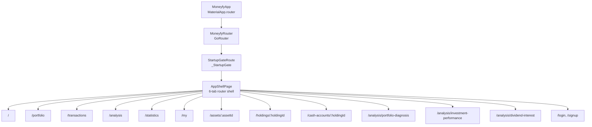

# Plan G. GoRouter 6탭 셸 전환

## 역할

현재 6탭 IA를 유지한 채 앱의 최상위 navigation 구조를 `go_router`와 `MaterialApp.router` 기반으로 전환한다.

Plan G는 5탭 통합이나 폼 route 전환이 아니라, **라우터 기반 앱 셸을 먼저 안정화하는 작업**이다. 기존 `AppShellPage`가 맡고 있는 데이터 refresh, auth state 대응, tab reselection, scroll controller 보존 책임은 약화하지 않는다.

## 현재 기준선

| 영역 | 현재 상태 | Plan G 판단 |
| --- | --- | --- |
| 앱 시작 | `MoneyfyApp` -> `MaterialApp(home: _StartupGate)` | `MaterialApp.router`로 바꾸되 `_StartupGate` 초기화 책임 유지 |
| 탭 셸 | `AppShellPage` 내부 `IndexedStack`과 floating tab bar | 6탭 유지, route path와 selected tab 동기화 |
| route registry | `MoneyfyRouteNames`, `MoneyfyRoutePaths` 존재 | GoRouter 정의의 단일 기준으로 사용 |
| 주요 상세 | Plan C helper가 `MaterialPageRoute`로 push | helper 내부를 router 기반으로 바꾸거나 router route를 직접 사용 |
| 폼 | `Navigator.push<bool>`와 저장 후 reload 의존 | Plan G에서는 유지 |
| 스냅샷/연도 분석 | 객체/list 직접 전달 | Plan G에서는 유지 또는 임시 push 유지 |
| 인증 | My 탭에서 로그인/회원가입 push | redirect 고도화 없이 기존 진입/뒤로가기 유지 |

## 결정

### G의 1차 목표

### 핵심 결정

- 하단 탭은 Plan G에서 6개를 유지한다.
- `MoneyfyRoutePaths.home`은 기존 값 `/`를 유지한다.
- `AppShellPage`의 polling, sync refresh, auth local clear, data scope overlay 책임은 유지한다.
- 탭 전환은 path 이동과 tab index 상태가 일치해야 한다.
- 같은 탭을 다시 누르면 기존처럼 해당 탭 scroll-to-top 또는 분석 reselection 동작이 유지되어야 한다.
- 상세/분석/auth 목적지는 router route로 등록하되, form route와 snapshot route는 Plan G 완료 조건에 넣지 않는다.
- `push<bool>` 저장 결과가 필요한 form 흐름은 `Navigator.push<bool>` 기반으로 남긴다.

## 범위

- `go_router` 의존성 추가.
- `MaterialApp.router` 전환.
- `lib/navigation/moneyfy_router.dart` 또는 동등한 router 구성 파일 추가.
- 6탭 route와 selected index 동기화.
- Plan C helper 대상 route의 GoRouter route 등록.
- Plan C helper 내부를 router 기반으로 전환할지, 호출부를 router API로 바꿀지 결정 후 일관 적용.
- `page_walkthrough_test.dart`의 기존 shell key 실패를 Plan G 기준으로 수정.
- route-level widget test 추가.
- `implementation_report_plan_g.md`, `test_report_plan_g.md` 작성.

## 제외

- 5탭 통합.
- 분석/통계 탭 통합.
- 폼 named route 전환.
- form edit loader 리팩터.
- `SnapshotDetailPage`, `AnnualAssetAnalysisPage`의 id 기반 loader 전환.
- auth redirect 고도화.
- 웹 deep link 완성.
- bottom sheet/dialog를 route로 승격.
- 데이터 모델, DB schema, sync protocol 변경.

## 산출물

- router 코드.
- 앱 셸 route 동기화 코드.
- route-level widget test.
- `docs/features/new_feature_development/page_flow_redesign/implementation_report_plan_g.md`
- `docs/features/new_feature_development/page_flow_redesign/test_report_plan_g.md`

## 대상 파일

| 파일 | 역할 |
| --- | --- |
| `pubspec.yaml` | `go_router` 의존성 추가 |
| `lib/main.dart` | `MaterialApp.router` 전환, `_StartupGate` 연결 방식 조정 |
| `lib/navigation/moneyfy_routes.dart` | route name/path 단일 출처 유지, 필요 시 query helper 추가 |
| `lib/navigation/moneyfy_navigation.dart` | helper를 router 기반으로 바꾸거나 호환 layer로 유지 |
| `lib/navigation/moneyfy_router.dart` | 신규 router 구성 파일 후보 |
| `lib/pages/app_shell_page.dart` | 6탭 route selected index 동기화, tab reselection 유지 |
| `test/page_walkthrough_test.dart` | shell tab key 기준 복구 및 router 기준 smoke 보강 |
| `test/widget_test.dart` | `MaterialApp.router` 전환에 따른 smoke expectation 갱신 |
| `test/router_smoke_test.dart` | 신규 route-level widget test 후보 |
| `docs/features/new_feature_development/page_flow_redesign/route_matrix.md` | Plan G 적용 결과 기록 |
| `docs/features/new_feature_development/page_flow_redesign/test_coverage_matrix.md` | Plan G 검증 결과 기록 |

## Route 적용 범위

### Shell Tabs

| route name | path | page | 완료 조건 |
| --- | --- | --- | --- |
| `home` | `/` | `PortfolioDashboardPage` | 앱 최초 진입과 직접 진입 모두 홈 탭 selected |
| `portfolio` | `/portfolio` | `PortfolioPage` | 탭 클릭과 직접 route 진입이 같은 화면 |
| `transactions` | `/transactions` | `TransactionsPage` | 거래 탭 상태와 floating tab selected 일치 |
| `analysis` | `/analysis` | `AnalysisPage` | 재탭 시 reselection tick 동작 유지 |
| `statistics` | `/statistics` | `StatisticsPage` | 통계 탭 direct route smoke 통과 |
| `my` | `/my` | `MyPage` | GPT용 DB 요약 복사 기능이 My 탭 안에 유지 |

### Detail / Analysis / Auth Routes

| route name | path | page | Plan G 처리 |
| --- | --- | --- | --- |
| `assetDetail` | `/assets/:assetId` | `AssetDetailPage` | router route 등록 |
| `holdingDetail` | `/holdings/:holdingId` | `HoldingDetailPage` | router route 등록 |
| `cashAccountDetail` | `/cash-accounts/:holdingId` | `CashAccountDetailPage` | router route 등록 |
| `portfolioDiagnosis` | `/analysis/portfolio-diagnosis` | `PortfolioAnalysisMvpPage` | router route 등록 |
| `investmentPerformance` | `/analysis/investment-performance` | `InvestmentPerformancePage` | router route 등록 |
| `dividendInterest` | `/analysis/dividend-interest` | `DividendInterestAnalysisPage` | router route 등록 |
| `login` | `/login` | `LoginPage` | router route 등록, redirect 없음 |
| `signup` | `/signup` | `SignupPage` | router route 등록, redirect 없음 |

### 유지 대상

| 대상 | 유지 방식 | 이유 |
| --- | --- | --- |
| `AssetFormPage` | 기존 `Navigator.push<bool>` | 저장 후 상위 reload 의존 |
| `HoldingFormPage` | 기존 `Navigator.push<bool>` | edit 객체 전달 및 상세 reload 의존 |
| `CashAccountFormPage` | 기존 `Navigator.push<bool>` | edit 객체 전달 및 상세 reload 의존 |
| `TransactionFormPage` | 기존 `Navigator.push<bool>` | ledger guard와 저장 결과 의존 |
| `CashTransactionFormPage` | 기존 `Navigator.push<bool>` | ledger guard와 저장 결과 의존 |
| `SnapshotDetailPage` | 기존 push 또는 객체 extra 유지 | id 기반 loader 없음 |
| `AnnualAssetAnalysisPage` | 기존 push 또는 객체 extra 유지 | snapshots/items list 직접 전달 |
| bottom sheets/dialogs | 기존 modal 유지 | route 전환 대상 아님 |

## 구현 단계

### G1. 라우터 의존성과 구성 파일 추가

목표:

- 라우터 정의를 앱 전역에 하나만 둔다.

구현:

- `go_router` 의존성을 추가한다.
- `lib/navigation/moneyfy_router.dart`를 추가한다.
- `MoneyfyRouteNames`와 `MoneyfyRoutePaths`를 사용해 route name/path를 정의한다.
- route builder에서 path parameter parsing 실패 시 안전한 fallback/error surface를 제공한다.

완료 조건:

- router 구성 파일이 존재한다.
- route path 문자열이 새 파일에 중복 하드코딩되지 않는다.
- 잘못된 int path parameter가 앱 crash로 이어지지 않는다.

### G2. `MoneyfyApp`을 `MaterialApp.router`로 전환

목표:

- 앱 루트가 router 기반으로 동작하게 한다.

구현:

- `MaterialApp`을 `MaterialApp.router`로 바꾼다.
- theme, darkTheme, themeMode, scrollBehavior, builder, debug banner 설정은 유지한다.
- `_StartupGate`는 router의 initial/root route에서 렌더한다.

주의:

- `_StartupGate._initialize()`의 `AuthService.initialize`, legacy cash cleanup, signed-out local data clear는 유지한다.
- startup splash/error 화면은 router 전환 후에도 같은 조건으로 보여야 한다.

완료 조건:

- 앱 첫 프레임에서 startup splash 또는 shell이 정상 렌더된다.
- startup error page를 route 전환 과정에서 제거하지 않는다.
- `test/widget_test.dart`의 `MaterialApp` expectation은 router 전환 기준으로 수정된다.

### G3. 6탭 shell route 동기화

목표:

- 현재 floating tab bar와 route path가 서로 어긋나지 않게 한다.

구현 후보:

- `AppShellPage`가 current location 또는 initial tab index를 받아 selected tab을 결정한다.
- 탭 클릭 시 `context.go(destination.routePath)`를 사용한다.
- 같은 탭 클릭 시 path 이동 없이 기존 reselection 동작만 실행한다.
- `IndexedStack`과 각 탭의 `ScrollController`는 유지한다.

주의:

- `bottom-tab-${item.label}` key는 테스트와 접근성 기준선이므로 유지한다.
- 탭 label은 Plan G에서 바꾸지 않는다.
- Plan H 전까지 `통계` 탭을 제거하거나 분석 탭에 합치지 않는다.

완료 조건:

- `/`, `/portfolio`, `/transactions`, `/analysis`, `/statistics`, `/my` 직접 진입 시 selected tab이 맞다.
- 탭 클릭 후 browser/router location이 맞다.
- 같은 탭 재클릭 시 scroll-to-top 또는 분석 reselection 동작이 유지된다.
- 탭별 scroll controller가 탭 전환만으로 dispose되지 않는다.

### G4. 주요 상세/분석/auth route 등록

목표:

- Plan C helper 대상 화면을 router destination으로 승격한다.

구현:

- asset/holding/cash account detail route를 등록한다.
- portfolio diagnosis, investment performance, dividend/interest route를 등록한다.
- login/signup route를 등록한다.
- optional client id는 query parameter 또는 helper argument로 보존한다.

주의:

- `assetClientId`, `holdingClientId` fallback이 사라지면 안 된다.
- 로그인 성공 후 `pop` 동작이 깨지면 Plan G 범위 안에서 호환 처리한다.
- auth redirect는 추가하지 않는다.

완료 조건:

- helper 대상 화면이 router route로 열릴 수 있다.
- 상세 화면에서 뒤로가기가 이전 탭 또는 이전 route로 돌아간다.
- 기존 helper 호출부의 의미가 유지된다.

### G5. form push 결과 보존 점검

목표:

- router 전환이 기존 저장 후 reload 흐름을 깨지 않게 한다.

구현:

- form 호출부는 기존 `Navigator.push<bool>`를 유지한다.
- router shell 안에서 `Navigator.of(context).push<bool>`가 기대한 navigator에 push되는지 확인한다.
- 필요하면 `rootNavigatorKey`와 shell navigator key 기준을 명확히 둔다.

완료 조건:

- 자산 생성/수정 후 홈/포트폴리오/자산 상세 refresh가 유지된다.
- 보유/현금 계좌 생성 후 자산 상세 reload가 유지된다.
- 거래 생성 후 거래 탭 또는 상세 화면 reload가 유지된다.

### G6. 테스트 정비

목표:

- 라우터 전환의 최소 회귀를 자동 테스트로 잡는다.

필수:

- `flutter analyze`
- `flutter test test/page_walkthrough_test.dart`
- `flutter test test/widget_test.dart`
- 신규 또는 보강 route-level widget test

권장:

- `flutter test test/transaction_flow_test.dart`
- `flutter test test/ui_component_smoke_test.dart`

테스트 추가 후보:

| 테스트 | 확인 |
| --- | --- |
| initial route smoke | `/`, `/portfolio`, `/transactions`, `/analysis`, `/statistics`, `/my` 직접 진입 |
| selected tab sync | route path별 `bottom-tab-*` selected semantics 확인 |
| tab click location | floating tab 클릭 시 router location 변경 |
| analysis reselection | 분석 탭 재클릭 동작 유지 |
| detail route smoke | `/assets/:id`, `/holdings/:id`, `/cash-accounts/:id` first frame |
| auth route smoke | `/login`, `/signup` first frame |
| shell key regression | `bottom-tab-홈` finder 실패 해결 |

완료 조건:

- 테스트 결과가 `test_report_plan_g.md`에 기록된다.
- 실패가 있으면 Plan G 회귀인지 기존 테스트 기준 문제인지 구분해 기록한다.

### G7. 문서와 완료 리포트

목표:

- 실제 구현 범위와 남은 범위를 문서에 남긴다.

구현:

- `route_matrix.md`에 Plan G 적용 결과 추가.
- `test_coverage_matrix.md`에 Plan G 실제 테스트 결과와 남은 gap 추가.
- `implementation_report_plan_g.md` 작성.
- `test_report_plan_g.md` 작성.
- `plan.md`에서 Plan G 상태를 완료 또는 보류로 갱신한다.

완료 조건:

- 구현한 route와 제외한 route가 문서에 분리되어 있다.
- Plan H/I가 자동 착수되지 않았음이 리포트에 기록된다.

## 완료 조건

- `MoneyfyApp`이 `MaterialApp.router` 기반으로 동작한다.
- `_StartupGate`의 초기화, splash, error 흐름이 보존된다.
- 6탭 경로 직접 진입과 탭 클릭 이동이 모두 동작한다.
- 탭 재선택, 탭별 scroll controller, data scope replacement, sync refresh 책임이 보존된다.
- Plan C helper 대상 상세/분석/auth route가 router route로 열린다.
- form 저장 후 이전 화면 갱신 구조가 보존된다.
- Android back, iOS swipe back 또는 그에 준하는 pop QA 결과가 기록된다.
- `implementation_report_plan_g.md`와 `test_report_plan_g.md`가 작성된다.
- 완료 후 Plan H 또는 Plan I를 자동으로 시작하지 않는다.

## 중단 조건

- `MaterialApp.router` 전환 후 `_StartupGate` 초기화 순서가 안정적으로 보존되지 않는다.
- form `push<bool>` 결과가 router shell 안에서 일관되게 돌아오지 않는다.
- tab state 보존을 위해 5탭 통합 또는 대규모 IA 변경이 필요해진다.
- 주요 테스트 실패 원인이 Plan G 범위 안에서 해결하기 어렵고 별도 리팩터가 필요하다.

중단 조건을 만나면 구현을 확대하지 않고 `implementation_report_plan_g.md`에 보류 사유와 후속 후보를 기록한다.

## 후속 후보

- Plan H: 5탭 통합 여부 결정.
- Plan I: form named route 전환과 id 기반 edit loader.
- Snapshot route loader 리팩터.
- Auth redirect와 protected route 정책.
- 웹 deep link와 browser history QA.
