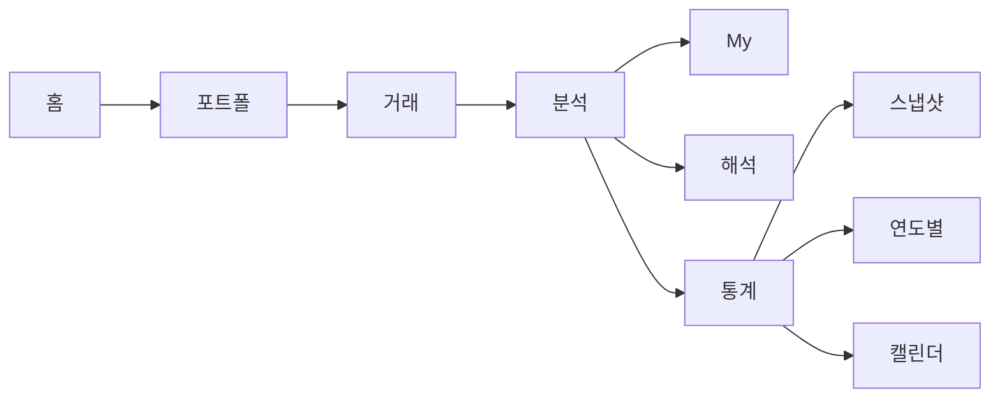

# Plan H. 5탭 통합 결정

## 역할

Plan G로 안정화된 6탭 router shell을 기준으로, **분석 탭과 통계 탭을 통합해 5탭으로 갈지 결정만 한다.**

Plan H는 구현 계획이 아니다. 이 단계의 목적은 “통합한다/유지한다/보류한다” 중 하나를 명시적으로 결정하고, 결정 근거와 후속 구현 범위를 문서화하는 것이다.

## 현재 기준선

| 영역 | 현재 상태 | Plan H 판단 포인트 |
| --- | --- | --- |
| 라우터 | Plan G에서 `MaterialApp.router`/`go_router` 전환 완료 | 6탭 path 직접 진입 가능 |
| 하단 탭 | 홈, 포트폴, 거래, 분석, 통계, My | 6탭이 다소 많은 대신 기능 경계가 명확함 |
| 분석 탭 | 뉴스, 포트폴리오 진단, 투자성과, 배당/이자 | 해석/회고 중심 |
| 통계 탭 | 월별 총자산, 월말 스냅샷, 연도별 분석, 캘린더 | 기록/시계열 조회 중심 |
| 스냅샷 route | 객체/list 직접 전달 구조 유지 | 5탭 통합 시에도 named route 전환은 별도 리팩터 필요 |
| My 탭 | 계정, 동기화, GPT용 DB 요약 복사 | 자주 쓰는 GPT 기능은 My 탭 안에 유지 |

## 결정 후보

### 후보 A. 6탭 유지

의미:

- Plan G 상태를 유지한다.
- 분석과 통계를 별도 탭으로 둔다.
- 사용자가 월별/스냅샷/캘린더를 독립 목적지로 빠르게 찾을 수 있다.

장점:

- 구현 비용이 없다.
- 통계 기능의 발견성이 가장 좋다.
- `StatisticsPage`, `SnapshotDetailPage`, `AnnualAssetAnalysisPage`의 객체 전달 구조를 건드리지 않아도 된다.
- Plan I form route 전환 전에 navigation 변경을 더 늘리지 않는다.

단점:

- 하단 탭 6개가 계속 유지되어 모바일 공간이 빡빡하다.
- 분석/통계가 모두 리포트성이라 IA 경계가 완전히 선명하지 않다.
- 장기 목표인 5탭 IA와는 다르다.

### 후보 B. 5탭 통합

의미:

- `통계` 탭을 제거하고 `분석` 내부 섹션 또는 탭으로 이동한다.
- 하단 탭은 홈, 포트폴, 거래, 분석, My 5개가 된다.
- `/statistics` path는 호환 route 또는 redirect로 보존한다.

장점:

- 하단 탭이 단순해진다.
- “리포트/회고/성과/스냅샷”을 분석 계열로 묶을 수 있다.
- 장기 IA 이미지와 맞는다.

단점:

- `AnalysisPage`가 과밀해질 수 있다.
- 통계 사용자의 직접 접근성이 떨어질 수 있다.
- `StatisticsPage`를 nested view로 넣을지, 별도 route로 두고 분석에서 링크할지 결정이 필요하다.
- `/statistics` 기존 route와 테스트를 보존해야 한다.

### 후보 C. 판단 보류

의미:

- 5탭 통합은 아직 하지 않고, Plan I 또는 snapshot loader 리팩터 이후 다시 결정한다.

선택 조건:

- 통계 사용 빈도나 실제 UX 판단 근거가 부족하다.
- `StatisticsPage`/snapshot 계열의 route 구조가 아직 무거워 통합 구현 리스크가 크다.
- 먼저 form route 안정화가 더 중요하다.

## 판단 기준

| 기준 | 질문 | 후보 A 유지에 유리 | 후보 B 통합에 유리 |
| --- | --- | --- | --- |
| 발견성 | 사용자가 통계를 자주 독립적으로 찾는가? | 그렇다 | 아니다 |
| 하단 탭 밀도 | 6탭이 실제 사용성을 해치는가? | 아니다 | 그렇다 |
| 기능 경계 | 분석과 통계의 목적이 충분히 다른가? | 다르다 | 겹친다 |
| 구현 리스크 | 통합 중 snapshot/annual flow가 흔들릴 가능성이 큰가? | 크다 | 작다 |
| 테스트 비용 | route/test 수정 범위가 과한가? | 과하다 | 감당 가능 |
| 장기 IA | 5탭 단순화가 제품 방향에 중요한가? | 낮다 | 높다 |

## 권장 결정 방식

1. 현재 6탭 유지 상태에서 분석/통계의 역할을 다시 읽는다.
2. 아래 질문에 답한다.
3. `five_tab_decision.md`에 결정을 기록한다.
4. 통합 결정 시에만 별도 구현 계획을 만든다.

### 결정 질문

| 질문 | 답변 후보 |
| --- | --- |
| 통계는 독립 탭으로 남아야 할 만큼 자주 쓰는 1차 목적지인가? | 예 / 아니오 / 근거 부족 |
| 분석 탭 안에 통계를 넣으면 사용자가 더 잘 이해할까? | 예 / 아니오 / 근거 부족 |
| `/statistics` 직접 진입을 유지해야 하는가? | 예 |
| 통합한다면 `StatisticsPage`를 분석 내부 embedded section으로 둘 것인가, 별도 route 링크로 둘 것인가? | embedded / 별도 route / 후속 결정 |
| Plan I보다 5탭 통합을 먼저 구현할 가치가 있는가? | 예 / 아니오 |

## 결정 산출물

Plan H 완료 시 아래 파일을 작성한다.

- `docs/features/new_feature_development/page_flow_redesign/five_tab_decision.md`

### `five_tab_decision.md` 필수 내용

| 섹션 | 내용 |
| --- | --- |
| 결정 | `6탭 유지`, `5탭 통합`, `보류` 중 하나 |
| 결정일 | 결정 날짜 |
| 근거 | 판단 기준별 요약 |
| 유지/통합 범위 | 통계 탭과 route를 어떻게 둘지 |
| 사용성 영향 | 하단 탭, 분석 화면, 통계 접근성 영향 |
| route 영향 | `/statistics`, `/analysis`, 하위 상세 route 보존 전략 |
| 테스트 영향 | 수정 또는 추가할 테스트 |
| 후속 작업 | 구현 계획이 필요한 경우 다음 계획 후보 |

## 5탭 통합 결정 시 후속 구현 초안

Plan H에서 `5탭 통합`으로 결정되면 즉시 구현하지 않고, 별도 사용자 승인 후 새 구현 계획을 만든다.

후속 구현 계획 후보:

- `Plan H-Impl. 5탭 Shell 통합`

포함 후보:

- `AppShellPage` destination에서 `통계` 탭 제거.
- `/statistics` route는 유지하되 shell selected tab은 `분석`으로 매핑.
- `AnalysisPage`에 통계 섹션 또는 segmented view 추가.
- `StatisticsPage` 직접 route smoke 유지.
- `page_walkthrough_test.dart`의 5탭 기대값 수정.
- `router_smoke_test.dart`에서 `/statistics` 호환 route 확인.

제외 후보:

- snapshot detail id 기반 loader.
- statistics UI 대규모 재설계.
- form named route 전환.
- My 탭 기능 재배치.

## 6탭 유지 결정 시 후속 처리

Plan H에서 `6탭 유지`로 결정되면 구현하지 않는다.

문서화할 내용:

- 통계가 독립 목적지로 남는 이유.
- 6탭 밀도가 현재 UI에서 허용 가능한 이유.
- `/statistics` route와 테스트를 그대로 유지한다는 점.
- 다음 구현 우선순위가 Plan I인지, snapshot loader 리팩터인지.

## 범위

- 5탭 전환의 이득/손실 재검토.
- 분석/통계 통합 여부 결정.
- `/statistics` route 보존 전략 결정.
- `five_tab_decision.md` 작성.
- 통합하기로 결정한 경우 별도 구현 계획 초안 작성.

## 제외

- 5탭 구현.
- `AppShellPage` destination 변경.
- `AnalysisPage`/`StatisticsPage` 코드 변경.
- 통계 기능 제거.
- snapshot/annual analysis route loader 리팩터.
- form named route 전환.
- My 탭 또는 GPT용 DB 요약 복사 기능 이동.

## 산출물

- `docs/features/new_feature_development/page_flow_redesign/five_tab_decision.md`
- 결정이 `5탭 통합`일 경우: 별도 구현 계획 초안
- 결정이 `6탭 유지` 또는 `보류`일 경우: 구현 없음

## 완료 조건

- `6탭 유지`, `5탭 통합`, `보류` 중 하나가 명시적으로 결정된다.
- 결정 근거가 판단 기준별로 기록된다.
- `/statistics` route 보존 여부가 기록된다.
- 통계 기능을 제거하지 않는다는 점이 명시된다.
- `내부 DB 요약 복사 (GPT)`는 My 탭에 유지한다는 점이 훼손되지 않는다.
- 통합하기로 결정한 경우에도 구현은 시작하지 않고 별도 계획으로 분리된다.
- 완료 후 Plan I 또는 5탭 구현을 자동으로 시작하지 않는다.

## 중단 조건

- 분석/통계 사용 목적을 구분할 근거가 부족해 결정이 임의적일 때.
- 5탭 구현 범위가 snapshot loader나 form route 전환까지 번질 때.
- 사용자가 5탭 통합보다 Plan I를 먼저 원한다고 결정할 때.

중단 조건을 만나면 `five_tab_decision.md`에 `보류`로 기록하고 다음 구현을 시작하지 않는다.
