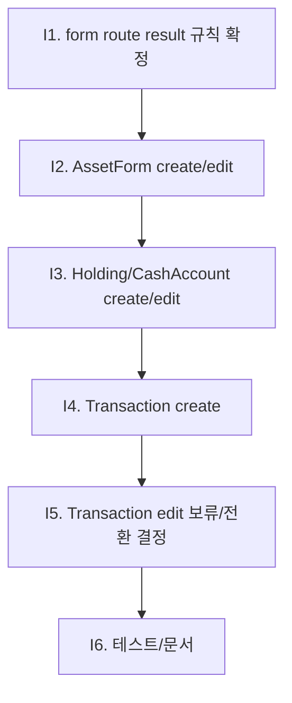

# Plan I. Form Named Route 전환

## 역할

폼 화면을 `go_router` named route로 전환하되, 기존 `Navigator.push<bool>` 기반 저장 후 갱신 의미를 보존한다.

Plan I는 단순히 route를 추가하는 작업이 아니다. 현재 폼들은 `save -> pop(true) -> 호출자 reload` 구조로 동작하며, edit 화면은 객체 전체를 생성자에 넘긴다. 따라서 Plan I의 핵심 역할은 **route 직접 진입 가능성, edit loader, 저장 결과 반환, 상위 refresh 책임을 분리해서 안전하게 전환하는 것**이다.

## 현재 기준선

| 영역 | 현재 상태 | Plan I 판단 |
| --- | --- | --- |
| router shell | Plan G/H-Impl 완료 | 폼 route 추가 가능 |
| asset create | 여러 화면에서 `AssetFormPage()` push | named route 전환 가능 |
| asset edit | `AssetItem` 객체 직접 전달 | id 기반 loader 또는 extra 전략 필요 |
| holding create | `assetId`로 `HoldingFormPage` push | named route 전환 가능 |
| holding edit | `HoldingItem` 객체 직접 전달 | id 기반 loader 또는 extra 전략 필요 |
| cash account create | `assetId`로 `CashAccountFormPage` push | named route 전환 가능 |
| cash account edit | `HoldingItem` 객체 직접 전달 | id 기반 loader 또는 extra 전략 필요 |
| transaction create | `assetId`, `holdingId`, optional `defaultName` 전달 | named route 전환 가능하나 `push<bool>` 보존 필요 |
| transaction edit | `TransactionItem` 객체 직접 전달 | ledger guard 때문에 고위험 |
| cash transaction create | `assetId`, `holdingId`, optional `defaultName` 전달 | named route 전환 가능하나 `push<bool>` 보존 필요 |
| cash transaction edit | `TransactionItem` 객체 직접 전달 | ledger guard 때문에 고위험 |

## 핵심 결정

### 전환 순서

### 원칙

- create route부터 전환한다.
- edit route는 id 기반 loader가 준비된 폼만 전환한다.
- edit loader가 과도하게 커지면 해당 폼 edit route는 보류하고 `extra` fallback 또는 기존 push를 유지한다.
- `push<bool>` 반환 의미는 Plan I에서 반드시 보존한다.
- 저장 성공 후 상위 화면의 reload 책임은 호출자가 유지한다.
- ledger 계산/검증 로직은 바꾸지 않는다.
- form UI 전면 개편은 하지 않는다.

## Route 범위

### 1차 전환 후보

| route name | path | page | 전달 방식 | 위험 |
| --- | --- | --- | --- | --- |
| `assetCreate` | `/assets/new` | `AssetFormPage` | 없음 | 낮음 |
| `assetEdit` | `/assets/:assetId/edit` | `AssetFormPage` | `assetId` loader 또는 extra | 중간 |
| `holdingCreate` | `/assets/:assetId/holdings/new` | `HoldingFormPage` | `assetId` path | 낮음 |
| `cashAccountCreate` | `/assets/:assetId/cash-accounts/new` | `CashAccountFormPage` | `assetId` path | 낮음 |
| `transactionCreate` | `/holdings/:holdingId/transactions/new` | `TransactionFormPage` | `holdingId`, query/defaultName, asset lookup | 중간 |
| `cashTransactionCreate` | `/cash-accounts/:holdingId/transactions/new` | `CashTransactionFormPage` | `holdingId`, query/defaultName, asset lookup | 중간 |

### 보류 가능성이 큰 route

| route name | path | 이유 |
| --- | --- | --- |
| `holdingEdit` | `/holdings/:holdingId/edit` | `HoldingItem` 전체 edit 객체 재구성 필요 |
| `cashAccountEdit` | `/cash-accounts/:holdingId/edit` | 현금 계좌도 `HoldingItem` 기반 edit 객체 필요 |
| `transactionEdit` | `/transactions/:transactionId/edit` | ledger event/line 기반 edit guard 재검증 필요 |
| `cashTransactionEdit` | `/cash-transactions/:transactionId/edit` | transfer/exchange paired ledger 재조회 필요 |

보류 route는 Plan I에서 무리해서 전환하지 않는다. 전환하지 않는 경우 `route_matrix.md`에 이유를 기록한다.

## 범위

- form route builder 추가.
- form navigation helper 추가.
- create route의 `push<bool>` result 보존.
- 가능한 edit route의 id 기반 loader 추가.
- 잘못된 id/path parameter 처리 UX 정의.
- 기존 호출부의 reload 로직 보존.
- route-level form tests 추가.
- `implementation_report_plan_i.md`, `test_report_plan_i.md` 작성.

## 제외

- 데이터 모델 변경.
- ledger 계산/검증 로직 변경.
- form UI 전면 개편.
- snapshot/annual analysis route loader 전환.
- auth redirect 정책.
- bottom sheet/dialog route 승격.
- My 탭 또는 GPT용 DB 요약 복사 기능 이동.

## 대상 파일

| 파일 | 역할 |
| --- | --- |
| `lib/navigation/moneyfy_routes.dart` | form route name/path 기준선 |
| `lib/navigation/moneyfy_router.dart` | form route 등록 |
| `lib/navigation/moneyfy_navigation.dart` | form open helper와 `Future<bool?>` 반환 |
| `lib/pages/forms/asset_form_page.dart` | asset edit loader 후보 |
| `lib/pages/forms/holding_form_page.dart` | holding create/edit route 대응 후보 |
| `lib/pages/forms/cash_account_form_page.dart` | cash account create/edit route 대응 후보 |
| `lib/pages/forms/transaction_form_page.dart` | investment transaction create route 대응 후보 |
| `lib/pages/forms/cash_transaction_form_page.dart` | cash transaction create route 대응 후보 |
| `lib/pages/portfolio_dashboard_page.dart` | asset form 호출부 |
| `lib/pages/portfolio_page.dart` | asset form 호출부 |
| `lib/pages/asset_detail_page.dart` | asset/holding/cash account form 호출부 |
| `lib/pages/holding_detail_page.dart` | holding/transaction form 호출부 |
| `lib/pages/cash_account_detail_page.dart` | cash account/cash transaction form 호출부 |
| `lib/pages/transactions_page.dart` | asset/transaction form 호출부 |
| `test/router_smoke_test.dart` | form route smoke |
| `test/page_walkthrough_test.dart` | form route first frame/flow smoke |
| `test/widget_test.dart` | form shortcut/save UI regression |
| `test/transaction_flow_test.dart` | ledger/domain regression |

## 구현 단계

### I1. Route result 계약 확정

목표:

- router 기반 form push가 기존 `Navigator.push<bool>`와 같은 의미를 갖게 한다.

결정:

- helper는 `Future<bool?>`를 반환한다.
- 호출자는 기존처럼 `if (changed == true) reload()`를 유지한다.
- 저장 성공 시 form은 기존처럼 `Navigator.pop(context, true)` 또는 `context.pop(true)`를 사용한다.
- 취소/뒤로가기는 `null` 또는 `false`로 취급한다.

구현:

- `MoneyfyNavigation`에 form open helper 후보 추가.
- helper 내부는 `context.push<bool>(path)`를 우선 사용한다.
- router context가 없는 standalone 환경은 기존 `Navigator.push<bool>` fallback을 둔다.

완료 조건:

- form helper가 `Future<bool?>` 반환을 보존한다.
- 호출부 reload 조건이 바뀌지 않는다.

### I2. AssetForm route 전환

목표:

- 가장 단순한 asset create/edit route를 먼저 전환한다.

구현:

- `assetCreate` route 등록.
- `openAssetCreate()` helper 추가.
- 홈/포트폴리오/거래 empty state의 asset create 호출부를 helper로 전환.
- edit은 아래 중 하나로 결정한다.
  - A안: `assetId` 기반 loader를 `AssetFormPage`에 추가.
  - B안: edit은 기존 `AssetItem` extra 또는 기존 push 유지.

완료 조건:

- asset create 저장 후 기존 호출자 reload가 유지된다.
- asset edit을 전환했다면 id 오류 처리 UX가 있다.
- asset edit을 보류했다면 이유가 문서화된다.

### I3. Holding/CashAccount create route 전환

목표:

- asset detail에서 보유 종목/현금 계좌 create route를 router helper로 전환한다.

구현:

- `holdingCreate`, `cashAccountCreate` route 등록.
- `openHoldingCreate(assetId)`, `openCashAccountCreate(assetId)` helper 추가.
- `AssetDetailPage._openHoldingForm`의 create path를 helper로 전환.
- edit은 id 기반 loader 준비 여부에 따라 전환 또는 보류한다.

완료 조건:

- 자산 상세에서 보유 종목/현금 계좌 생성 후 `_reloadDetail()`이 유지된다.
- edit 보류 또는 전환 여부가 명확히 기록된다.

### I4. Transaction create route 전환

목표:

- 거래 생성 route를 named route로 전환하되 ledger save 동작은 건드리지 않는다.

구현:

- `transactionCreate`, `cashTransactionCreate` route 등록.
- route 진입 시 `holdingId`로 `assetId`를 찾는 loader를 추가하거나, query/extra로 `assetId`를 보존한다.
- `defaultName`, `holdingClientId` 필요 값을 query 또는 extra로 전달한다.
- `TransactionsPage`, `HoldingDetailPage`, `CashAccountDetailPage` create 호출부를 helper로 전환한다.

주의:

- investment/cash transaction edit은 이 단계에서 전환하지 않는다.
- ledger 계산, cash balance validation, transfer/exchange pair 생성 로직을 바꾸지 않는다.

완료 조건:

- 투자 거래 생성 후 호출자 reload가 유지된다.
- 현금 거래 생성 후 호출자 reload가 유지된다.
- `transaction_flow_test.dart`가 통과한다.

### I5. Transaction edit route 결정

목표:

- edit route를 지금 전환할지, 별도 후속으로 남길지 결정한다.

판단 기준:

| 조건 | 전환 가능 |
| --- | --- |
| `transactionId` 또는 `ledgerEventId`로 edit item을 안정적으로 재구성 가능 | 예 |
| paired transfer/exchange edit guard를 route loader에서 보존 가능 | 예 |
| 기존 edit 객체와 동일한 form 초기 상태를 만들 수 없음 | 아니오 |
| 구현 중 ledger 계산 로직 변경이 필요함 | 아니오 |

완료 조건:

- edit route 전환/보류 결정이 문서화된다.
- 보류 시 기존 edit push는 유지된다.

### I6. Invalid route UX

목표:

- 잘못된 id 직접 진입이 crash로 이어지지 않게 한다.

구현:

- path int parse 실패, 존재하지 않는 asset/holding/transaction id, 타입 불일치에 대한 fallback surface 정의.
- 기존 router invalid page 또는 inline error page 사용.

완료 조건:

- 잘못된 form route smoke가 crash 없이 오류 화면을 표시한다.

### I7. 테스트

필수:

- `dart format` 대상 파일.
- `flutter analyze`
- `flutter test test/router_smoke_test.dart`
- `flutter test test/page_walkthrough_test.dart`
- `flutter test test/widget_test.dart`
- `flutter test test/transaction_flow_test.dart`

추가 후보:

| 테스트 | 확인 |
| --- | --- |
| asset create route smoke | `/assets/new` first frame |
| holding create route smoke | `/assets/:assetId/holdings/new` first frame |
| cash account create route smoke | `/assets/:assetId/cash-accounts/new` first frame |
| transaction create route smoke | `/holdings/:holdingId/transactions/new` first frame |
| cash transaction create route smoke | `/cash-accounts/:holdingId/transactions/new` first frame |
| form pop result | save/cancel이 `Future<bool?>` 의미를 유지 |
| invalid id route | 잘못된 id가 crash 없이 오류 화면 |

완료 조건:

- 테스트 결과가 `test_report_plan_i.md`에 기록된다.
- 실패가 있으면 Plan I 회귀인지 기존 테스트 한계인지 분리 기록한다.

### I8. 문서/리포트

산출물:

- `implementation_report_plan_i.md`
- `test_report_plan_i.md`
- `route_matrix.md` Plan I 적용 결과 갱신
- `test_coverage_matrix.md` Plan I 실제 검증 결과 갱신
- `plan.md` 상태 갱신

완료 조건:

- 전환한 route와 보류한 route가 분리되어 있다.
- form save result 보존 방식이 기록된다.
- 다음 작업을 자동으로 만들거나 시작하지 않는다.

## 완료 조건

- 선택한 form route가 named route로 등록된다.
- 전환한 create route의 저장/취소 결과가 기존 호출자 reload와 동일하게 동작한다.
- edit route는 전환 또는 보류 결정이 명확하다.
- 잘못된 id 직접 진입 처리 UX가 정의된다.
- `transaction_flow_test.dart` 포함 필수 테스트 결과가 기록된다.
- Plan I 이후 별도 후속 후보는 문서에만 남기고 자동 착수하지 않는다.

## 중단 조건

- form edit loader 구현이 데이터 모델 변경을 요구한다.
- transaction edit 전환 중 ledger 계산/검증 로직 변경이 필요해진다.
- `push<bool>` result를 router 전환 후 안정적으로 보존할 수 없다.
- create route 전환만으로도 상위 refresh가 깨진다.

중단 조건을 만나면 범위를 확대하지 않고 구현 가능한 create route까지만 완료 또는 보류 리포트를 작성한다.
