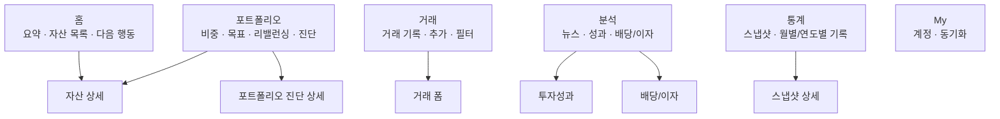
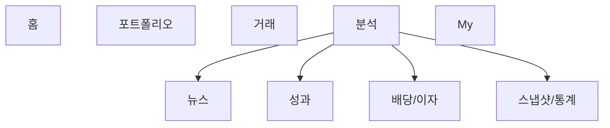

# MONEYFY Page Flow Review

조사 기준: `docs/page_inventory_graph.md`의 전수조사 결과와 `lib/pages/**`의 실제 탭/CTA/`Navigator.push` 흐름을 함께 봤다. 결론부터 말하면 현재 구조는 기능적으로는 크게 막히지 않지만, 사용자가 “어디에서 무엇을 해야 하는지”를 배울 때 헷갈릴 수 있는 중복과 명명 문제가 있다.

전체 개편 실행 계획은 `docs/features/new_feature_development/page_flow_redesign/plan.md`에 별도로 확장 정리했다.

## 전체 평가

현재 IA의 좋은 점:

- 하단 탭이 핵심 도메인인 홈, 포트폴리오, 거래, 분석, 통계, My로 분리되어 있어 기능 발견성은 좋다.
- `IndexedStack` 기반 탭 구조라 탭별 스크롤/상태 유지가 자연스럽다.
- 거래 추가, 자산 추가, 상세 수정 흐름은 대부분 원래 맥락으로 되돌아오며 데이터도 갱신한다.
- 상세 페이지 계층은 `자산군 -> 보유 종목/현금 계좌 -> 거래`로 비교적 명확하다.

하지만 현재 구조는 탭이 6개라 모바일 기준으로 약간 촘촘하고, `포트폴리오 진단`/`AI 포트폴리오 분석`/`포트폴리오 탭의 진단 카드`가 서로 다른 경로에 흩어져 있다. 이 부분이 가장 큰 개선 포인트다.

## 주요 문제점

### P1. 포트폴리오 진단이 두 군데로 갈라져 보인다

- 홈의 진단 카드는 `AppShellPage._openPortfolioDiagnosisFromHome()`를 통해 포트폴리오 탭으로 이동하고 진단 카드에 포커스한다. 근거: `lib/pages/app_shell_page.dart:167`, `lib/pages/app_shell_page.dart:258`, `lib/pages/portfolio_page.dart:220`.
- 분석 탭에는 별도 `PortfolioAnalysisMvpPage` 진입 카드가 있다. 근거: `lib/pages/analysis_page.dart:89`.
- 포트폴리오 탭 안에는 다시 `AI 포트폴리오 분석` 카드가 있다. 근거: `lib/pages/portfolio_page.dart:895`.

사용자 입장에서는 “포트폴리오 진단”이 포트폴리오 탭에 있는 것인지, 분석 탭에 있는 것인지, AI 분석과 MVP 분석이 같은 것인지 다른 것인지 판단하기 어렵다.

권장:

- 단기: 분석 탭의 `포트폴리오 진단` 카드를 포트폴리오 탭 진단 카드와 같은 목적지로 통일하거나, 이름을 명확히 분리한다.
- 중기: `PortfolioAnalysisMvpPage`를 포트폴리오 탭의 상세 분석 페이지로 승격하고, 홈/포트폴리오/분석 어디에서 눌러도 같은 상세 페이지로 이동하게 한다.
- 장기: 포트폴리오 탭은 “구성/목표/리밸런싱”, 분석 탭은 “성과/수익/뉴스/스냅샷”처럼 책임을 나눈다.

### P1. 포트폴리오 탭에서 자산 상세로 들어갈 수 없다

- 자산 상세 진입은 홈 자산 목록에서만 확인된다. 근거: `lib/pages/portfolio_dashboard_page.dart:1753`.
- 포트폴리오 탭은 비중 차트, 리밸런싱, 진단을 보여주지만 자산군 상세로 연결되지 않는다. 근거: `lib/pages/portfolio_page.dart:202`.

비중 차트나 리밸런싱에서 특정 자산의 문제를 발견한 사용자는 자연스럽게 그 자산 상세로 들어가고 싶다. 지금은 홈 탭으로 이동해 같은 자산을 다시 찾아야 해서 흐름이 끊긴다.

권장:

- 포트폴리오 탭의 비중 리스트 항목에 `AssetDetailPage` 진입을 추가한다.
- 리밸런싱 행도 가능하면 해당 자산 상세 또는 목표 비중 수정 시트로 연결한다.
- 선택만 하는 인터랙션과 상세 진입 인터랙션이 충돌하면, 행 탭은 상세 진입, 차트/칩 탭은 선택으로 역할을 나누는 편이 좋다.

### P2. 하단 탭 6개는 정보 구조가 조금 무겁다

- 현재 탭은 홈, 포트폴, 거래, 분석, 통계, My 6개다. 근거: `lib/pages/app_shell_page.dart:35`.
- 분석과 통계는 둘 다 리포트성 화면이고, 스냅샷/연도별 자산분석 같은 흐름이 겹친다. 근거: `lib/pages/analysis_page.dart:78`, `lib/pages/statistics_page.dart:125`.

6개 탭 자체가 불가능한 구조는 아니지만, 모바일에서는 한 탭당 의미 밀도가 낮아지고 “분석”과 “통계”의 차이를 사용자가 계속 기억해야 한다.

권장:

- 단기: 탭 명칭을 더 선명하게 만든다. 예: `분석`은 `인사이트`, `통계`는 `기록` 또는 `스냅샷`.
- 중기: 분석+통계를 하나의 `분석` 탭으로 합치고 내부 탭/세그먼트로 `인사이트`, `성과`, `스냅샷`을 나눈다.
- 유지한다면: 분석은 해석/추천, 통계는 원자료/히스토리라는 기준을 UI 제목과 카드 순서에서 일관되게 드러낸다.

### P2. 거래 탭의 빈 상태가 다음 행동으로 이어지지 못한다

- 거래 탭은 계좌가 없으면 “자산이나 현금 계좌를 먼저 추가해 주세요”라고 안내하지만 액션은 없다. 근거: `lib/pages/transactions_page.dart:389`.
- 거래 추가 버튼도 계좌가 없으면 비활성화된다. 근거: `lib/pages/transactions_page.dart:339`.

초기 사용자는 거래 탭에서 막혔을 때 자산 추가로 바로 이동하고 싶다. 지금은 홈/포트폴리오 탭을 직접 찾아야 한다.

권장:

- 계좌가 없을 때 빈 상태 CTA를 `자산 추가`로 바꾸고 `AssetFormPage`를 열도록 한다.
- 또는 앱 셸 콜백을 통해 홈/포트폴리오로 이동시키되, 실제 자산 추가 폼까지 바로 열리는 편이 더 좋다.

### P2. My 탭의 GPT 연계 유틸리티 명칭과 위치를 다듬을 여지가 있다

- `내부 DB 요약 복사 (GPT)`가 계정 및 동기화 섹션 안에 있다. 근거: `lib/pages/my_page.dart:880`.

이 기능은 자주 쓰는 핵심 유틸리티이므로 숨기거나 개발자 옵션으로 보내지 않는다. 다만 현재 명칭은 내부 구현 도구처럼 보일 수 있어, 사용 목적이 드러나는 이름과 섹션으로 정돈하면 더 좋다.

권장:

- My 탭에서 계속 1급 액션으로 유지한다.
- `GPT용 DB 요약 복사`, `GPT 분석용 데이터 복사`처럼 사용 목적이 드러나는 이름을 검토한다.
- 계정/동기화 섹션 안에 유지하되, 가능하면 `데이터 내보내기` 또는 `GPT 연계` 하위 묶음으로 시각적 구분만 준다.

### P3. 홈과 포트폴리오의 역할이 일부 중복된다

- 홈에서 자산 추가와 자산 상세 진입을 담당한다. 근거: `lib/pages/portfolio_dashboard_page.dart:154`, `lib/pages/portfolio_dashboard_page.dart:1753`.
- 포트폴리오에서도 자산 추가가 가능하지만, 설명은 “Home에서 자산을 등록”이라고 말한다. 근거: `lib/pages/portfolio_page.dart:191`.

실제 버튼은 포트폴리오 탭에서도 열리는데 문구는 Home을 가리켜 약간 어긋난다.

권장:

- 문구를 “자산을 등록한 뒤” 정도로 탭 이름 의존 없이 바꾼다.
- 홈은 요약/최근 변화/다음 행동, 포트폴리오는 구성/목표/리밸런싱으로 역할을 명시한다.

## 권장 IA

### 최소 변경안

실행 우선순위:

1. 포트폴리오 탭 자산 항목에서 `AssetDetailPage` 진입 추가.
2. 홈/분석/포트폴리오의 `포트폴리오 진단` 목적지 통일.
3. 거래 빈 상태에서 `자산 추가` CTA 제공.
4. My 탭의 GPT용 DB 요약 복사 액션은 유지하되 명칭/묶음을 정돈.
5. 분석/통계 탭 이름과 카드 배치를 재정의.

### 조금 더 나은 개편안

하단 탭을 5개로 줄인다.

이 방식은 `분석`과 `통계`의 경계를 사용자가 외우지 않아도 된다. 대신 분석 탭 내부가 커지므로 상단 세그먼트나 섹션 앵커가 필요하다.

## 결론

현재 페이지 흐름은 “기능적으로는 성립”하지만, 제품 관점에서는 포트폴리오 진단의 목적지 중복과 포트폴리오 탭의 상세 진입 부재가 가장 먼저 손볼 지점이다. 이 두 개만 정리해도 앱의 중심 여정인 `요약 확인 -> 문제 발견 -> 상세 확인 -> 수정/거래 기록` 흐름이 훨씬 매끄러워진다.
