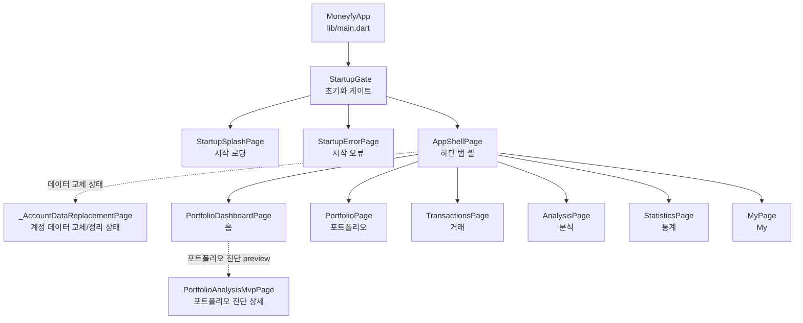
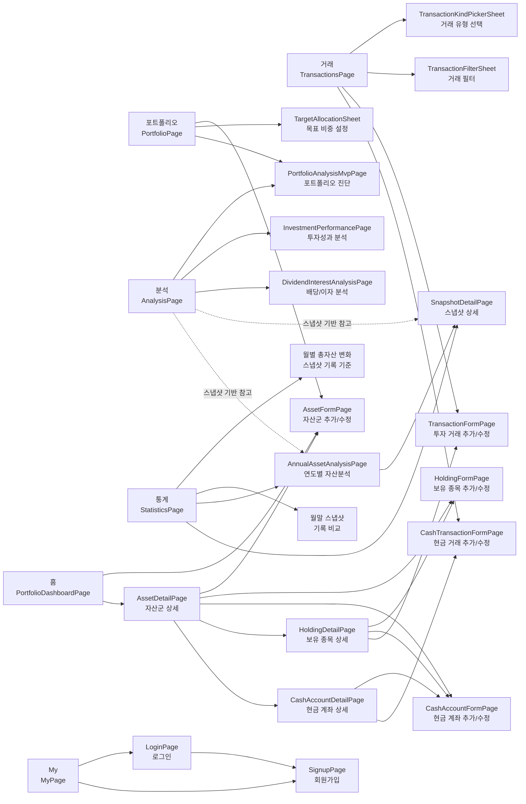
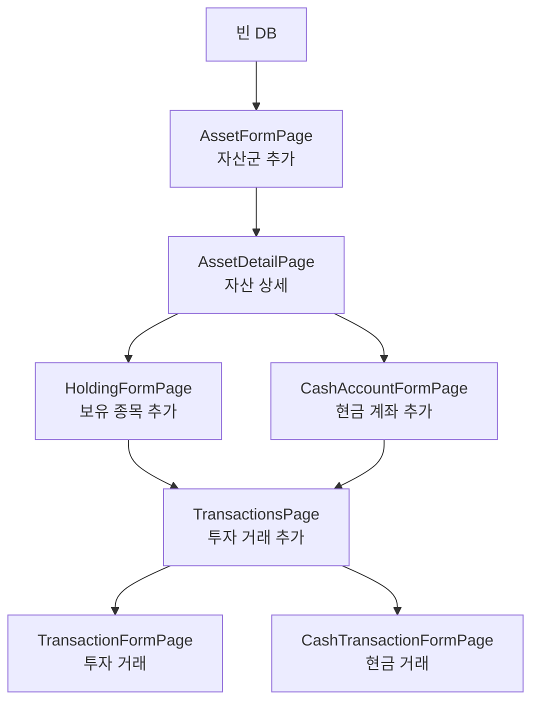

# MONEYFY Page Inventory Graph

조사 기준: `lib/main.dart`, `lib/pages/**`, `Navigator.push(MaterialPageRoute)`, `showModalBottomSheet`, `showDialog` 호출 기준으로 현재 앱에서 사용자에게 독립 화면처럼 노출되는 페이지/시트/다이얼로그를 전수 정리했다. 라우팅은 선언형 라우터 없이 `MaterialApp.home`과 `Navigator` 직접 호출로 구성되어 있다.

## 요약

- 시작/셸: 4개
- 하단 탭 루트: 6개
- 상세/분석 페이지: 8개
- 인증 페이지: 2개
- 입력 폼 페이지: 5개
- 바텀시트/선택 시트: 5개
- 확인/입력 다이얼로그: 여러 호출 지점에서 공통 패턴으로 사용

## 전체 진입 그래프

## 페이지 이동 그래프

## 모달/시트 그래프

```mermaid
flowchart TD
  My["MyPage"] --> ConfigSheet["설정 안내 BottomSheet"]
  My --> DeleteDialog["계정 삭제/로그아웃 확인 Dialog"]
  My --> ProfileDialog["프로필 이름 입력 Dialog"]
  My --> PasswordDialog["비밀번호 변경 Dialog"]

  Portfolio["PortfolioPage"] --> TargetSheet["TargetAllocationSheet"]

  Transactions["TransactionsPage"] --> KindSheet["TransactionKindPickerSheet"]
  Transactions --> FilterSheet["TransactionFilterSheet"]
  Transactions --> TxDeleteDialog["거래 삭제 확인 Dialog"]

  Forms["Form Pages<br/>Asset/Holding/Cash/Transaction"] --> SelectionSheet["MoneyfySelectionSheet<br/>공통 선택 시트"]

  AssetDetail["AssetDetailPage"] --> AssetDeleteDialog["자산군 삭제 확인 Dialog"]
  HoldingDetail["HoldingDetailPage"] --> HoldingDeleteDialog["보유 종목/거래 삭제 확인 Dialog"]
  CashDetail["CashAccountDetailPage"] --> CashDeleteDialog["현금 계좌/거래 삭제 확인 Dialog"]
  SnapshotDetail["SnapshotDetailPage"] --> SnapshotDialog["스냅샷 저장/삭제 확인 Dialog"]
```

## 첫 입력 흐름

## 페이지 인벤토리

| 분류 | 페이지/서피스 | 파일 | 주요 진입 |
| --- | --- | --- | --- |
| 시작 | `StartupSplashPage` | `lib/main.dart` | `_StartupGate` 초기화 대기 |
| 시작 | `StartupErrorPage` | `lib/main.dart` | `_StartupGate` 초기화 실패 |
| 시작 | `AppShellPage` | `lib/pages/app_shell_page.dart` | `_StartupGate` 초기화 완료 |
| 시작 상태 | `_AccountDataReplacementPage` | `lib/pages/app_shell_page.dart` | 로그아웃 정리/계정 데이터 교체 중 탭 대체 화면 |
| 탭 | `PortfolioDashboardPage` | `lib/pages/portfolio_dashboard_page.dart` | 하단 탭 `홈` |
| 탭 | `PortfolioPage` | `lib/pages/portfolio_page.dart` | 하단 탭 `포트폴` |
| 탭 | `TransactionsPage` | `lib/pages/transactions_page.dart` | 하단 탭 `거래` |
| 탭 | `AnalysisPage` | `lib/pages/analysis_page.dart` | 하단 탭 `분석` |
| 탭 | `StatisticsPage` | `lib/pages/statistics_page.dart` | 하단 탭 `통계` |
| 탭 | `MyPage` | `lib/pages/my_page.dart` | 하단 탭 `My` |
| 상세 | `AssetDetailPage` | `lib/pages/asset_detail_page.dart` | 홈 자산 목록 |
| 상세 | `HoldingDetailPage` | `lib/pages/holding_detail_page.dart` | 자산군 상세의 투자 보유 종목 |
| 상세 | `CashAccountDetailPage` | `lib/pages/cash_account_detail_page.dart` | 자산군 상세의 현금 계좌 |
| 상세 | `SnapshotDetailPage` | `lib/pages/snapshot_detail_page.dart` | 통계 primary, 분석 보조 진입, 연도별 분석의 스냅샷 항목 |
| 분석/통계 | `AnnualAssetAnalysisPage` | `lib/pages/annual_asset_analysis_page.dart` | 통계 primary, 분석 보조 진입의 연도별 자산 분석 |
| 분석 | `PortfolioAnalysisMvpPage` | `lib/pages/portfolio_analysis_mvp_page.dart` | 홈/포트폴리오/분석의 포트폴리오 진단 상세 |
| 분석 | `InvestmentPerformancePage` | `lib/pages/investment_performance_page.dart` | 분석 탭의 투자성과 분석 |
| 분석 | `DividendInterestAnalysisPage` | `lib/pages/dividend_interest_analysis_page.dart` | 분석 탭의 배당/이자 분석 |
| 인증 | `LoginPage` | `lib/pages/login_page.dart` | My 탭 로그인, 로그인 화면에서 회원가입 이동 |
| 인증 | `SignupPage` | `lib/pages/signup_page.dart` | My 탭 회원가입, 로그인 화면 |
| 폼 | `AssetFormPage` | `lib/pages/forms/asset_form_page.dart` | 홈/포트폴리오/자산군 상세 |
| 폼 | `HoldingFormPage` | `lib/pages/forms/holding_form_page.dart` | 자산군 상세/보유 종목 상세 |
| 폼 | `CashAccountFormPage` | `lib/pages/forms/cash_account_form_page.dart` | 자산군 상세/보유 종목 상세/현금 계좌 상세 |
| 폼 | `TransactionFormPage` | `lib/pages/forms/transaction_form_page.dart` | 거래 탭/보유 종목 상세 |
| 폼 | `CashTransactionFormPage` | `lib/pages/forms/cash_transaction_form_page.dart` | 거래 탭/현금 계좌 상세 |
| 시트 | `_TargetAllocationSheet` | `lib/pages/target_allocation_sheet.dart` | 포트폴리오 탭 목표 비중 설정 |
| 시트 | `_TransactionKindPickerSheet` | `lib/pages/transactions_page.dart` | 거래 탭 추가 플로우 |
| 시트 | `_TransactionFilterSheet` | `lib/pages/transactions_page.dart` | 거래 탭 필터 |
| 시트 | `_MoneyfySelectionSheet` | `lib/pages/forms/form_design.dart` | 폼 공통 선택 필드 |
| 시트 | 설정 안내 BottomSheet | `lib/pages/my_page.dart` | My 탭 동기화 설정 안내 |

## 관찰 메모

- 앱의 최상위 내비게이션은 `IndexedStack` 기반 6개 탭이다.
- 상세/폼 화면은 모두 `MaterialPageRoute`로 직접 push된다.
- `PortfolioPage`에는 자산군 상세 진입, 목표 비중 설정, 포트폴리오 진단 생성/상세 진입이 있다.
- `SyncOverlay`는 페이지 파일에 있지만 현재 조사 범위에서는 독립 내비게이션 대상이 아닌 오버레이 위젯이다.
- 여러 다이얼로그는 별도 클래스 페이지가 아니라 각 페이지 내부의 `showDialog` 빌더로 구성되어 있어, 그래프에서는 기능 단위로 묶었다.
