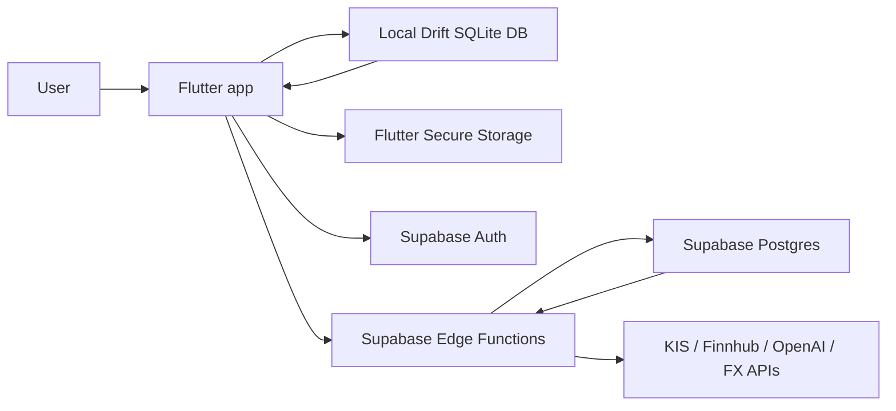

# MONEYFY Project Overview

이 문서는 MONEYFY를 처음 보는 사람이 앱의 목적, 실행 구조, 주요 기능을 빠르게 이해하도록 돕는 입문 문서입니다.

## Product Summary

MONEYFY는 개인 자산을 자산군, 보유 종목, 현금 계좌, 거래 내역, 스냅샷 단위로 관리하는 Flutter 앱입니다. 사용자는 로컬에서 데이터를 입력하고, 로그인한 경우 Supabase를 통해 여러 기기에서 핵심 데이터를 동기화합니다.

앱은 투자 판단을 대신하지 않고, 사용자가 보유 자산의 흐름을 더 잘 읽도록 돕는 관리 도구에 가깝습니다. 대시보드, 포트폴리오, 분석, 통계, My 탭이 하단 내비게이션의 중심입니다.

## Main Capabilities

- 자산군별 총액, 손익, 비중 확인
- 보유 종목과 현금 계좌 등록 및 수정
- 매수, 매도, 배당, 이자, 입출금, 이체, 환전 기록
- 거래 원장 기반 수량, 원가, 실현손익, 현금 잔액 재계산
- 일별 포트폴리오 스냅샷 저장과 과거 상세 확인
- 월별 자산 추이, 캘린더, 연간 분석, 배당/이자 분석
- KIS, 코인 시세, 환율 API 기반 가격 갱신
- Supabase Auth, Edge Functions, 원격 DB 동기화
- OpenAI 기반 포트폴리오 진단과 뉴스 요약 표시

## Runtime Architecture



## App Startup

`lib/main.dart`가 앱 시작점입니다.

1. Flutter binding을 초기화합니다.
2. `AuthService.initialize()`가 `assets/config.json`에서 Supabase URL과 anon key를 읽고 Supabase SDK를 초기화합니다.
3. 레거시 seed 현금 보유 항목을 정리합니다.
4. 로그인 사용자가 없으면 로컬 사용자 데이터를 비웁니다.
5. `MoneyfyApp`이 `AppShellPage`를 홈으로 띄웁니다.

초기화 실패 시 `StartupErrorApp`이 오류 메시지를 보여줍니다.

## Main Navigation

`lib/features/shell/screens/app_shell_page.dart`는 앱의 하단 탭과 공통 새로고침 흐름을 관리합니다.

| 탭 | 주요 파일 | 역할 |
| --- | --- | --- |
| 홈 | `lib/features/portfolio/screens/portfolio_dashboard_page.dart` | 총자산, 주요 지표, 포트폴리오 진단 진입 |
| 포트폴리오 | `lib/features/portfolio/screens/portfolio_page.dart` | 자산군, 보유 종목, 현금 계좌 관리 |
| 분석 | `lib/features/analysis/screens/analysis_page.dart` | 배분, 성과, 진단, 뉴스 요약 |
| 통계 | `lib/features/account/screens/statistics_page.dart` | 월별 추이, 캘린더, 스냅샷 |
| My | `lib/features/account/screens/my_page.dart` | 로그인, 동기화, 설정성 작업 |

앱은 1분 간격으로 시장 데이터와 환율 갱신을 시도하고, 앱이 foreground로 돌아오거나 인증 상태가 바뀌면 Supabase에서 원격 데이터를 다시 당겨옵니다.

## Local-First Principle

MONEYFY의 대부분 화면은 로컬 Drift DB를 직접 읽습니다. 입력과 수정도 먼저 로컬에 반영되며, 동기화 가능한 사용자인 경우 dirty payload가 Supabase로 전송됩니다.

이 구조의 장점은 네트워크가 불안정해도 주요 화면과 입력 흐름이 유지된다는 점입니다. 원격 데이터는 백업과 멀티 디바이스 동기화, 서버 계산, AI/뉴스 기능에 사용됩니다.

## Important Files

| 파일 | 역할 |
| --- | --- |
| `lib/main.dart` | 앱 초기화와 MaterialApp 구성 |
| `lib/features/shell/screens/app_shell_page.dart` | 하단 탭, 앱 생명주기, 주기적 갱신 |
| `lib/db/app_database.dart` | Drift 테이블, 쿼리, 마이그레이션, 원장 재계산 |
| `lib/features/auth/services/auth_service.dart` | Supabase 초기화와 로그인/회원가입/로그아웃 |
| `lib/features/sync/services/sync_service.dart` | 로컬 dirty payload push와 원격 pull |
| `lib/features/portfolio/services/market_data_service.dart` | KIS, 코인, 환율 기반 시장 데이터 갱신 |
| `supabase/functions/*/index.ts` | Edge Function API |
| `supabase/migrations/*.sql` | 원격 Postgres schema 변경 이력 |

## Development Commands

```bash
flutter pub get
flutter analyze
flutter test
dart run build_runner build --delete-conflicting-outputs
```

Drift 테이블이나 DAO 성격의 코드가 바뀌면 `app_database.g.dart`를 다시 생성해야 합니다.

## Configuration

실제 키는 git에 올리지 않습니다.

- Flutter Supabase client: `assets/config.json`
- 예시 파일: `assets/config.example.json`, `config.example.json`
- KIS 등 실행 시 값: `--dart-define` 또는 로컬 설정
- Supabase server secrets: Supabase Dashboard 또는 CLI secrets

자세한 Supabase 운영 절차는 [Supabase CLI Runbook](supabase_cli_runbook.md)을 참고하세요.
